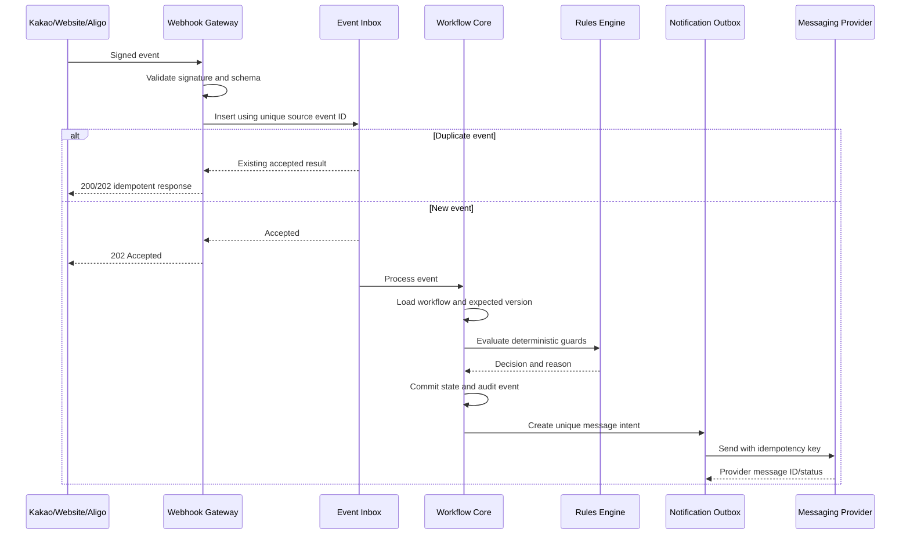
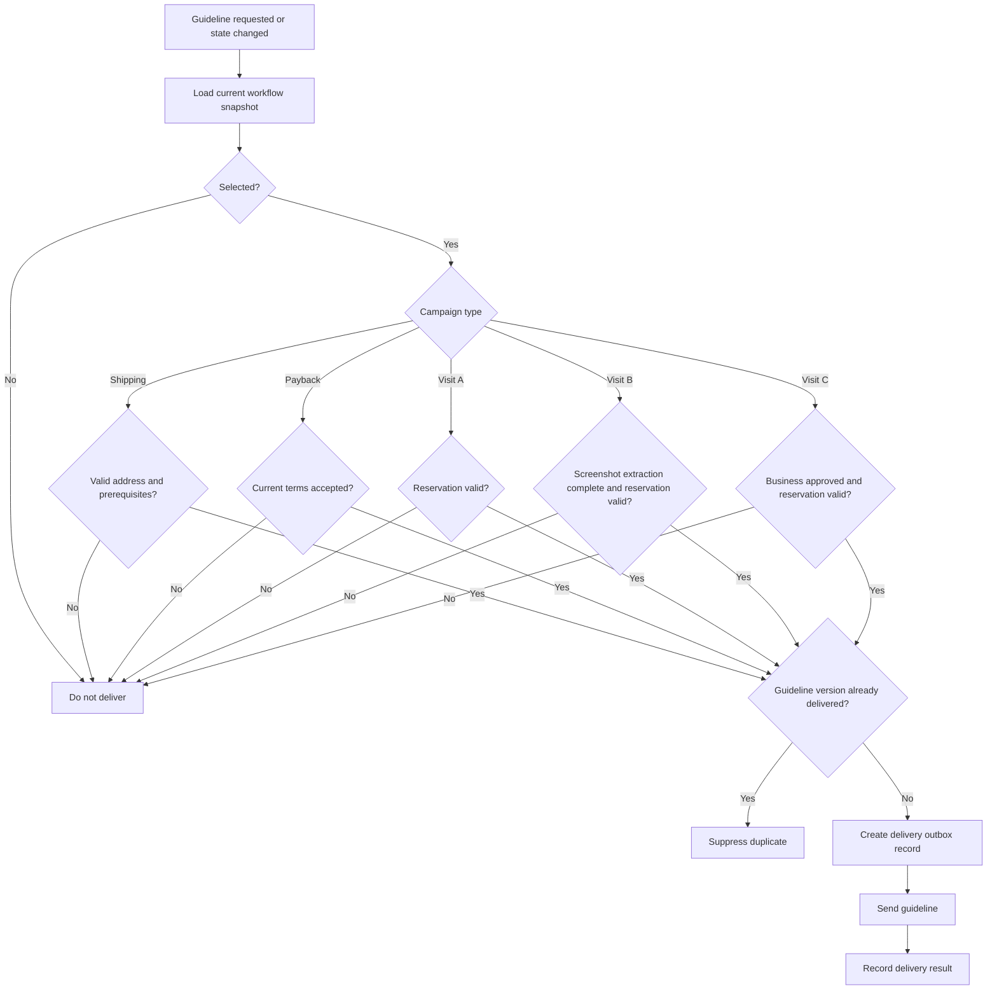
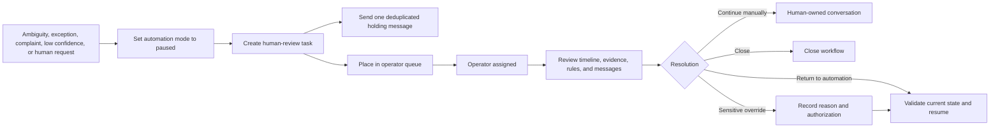
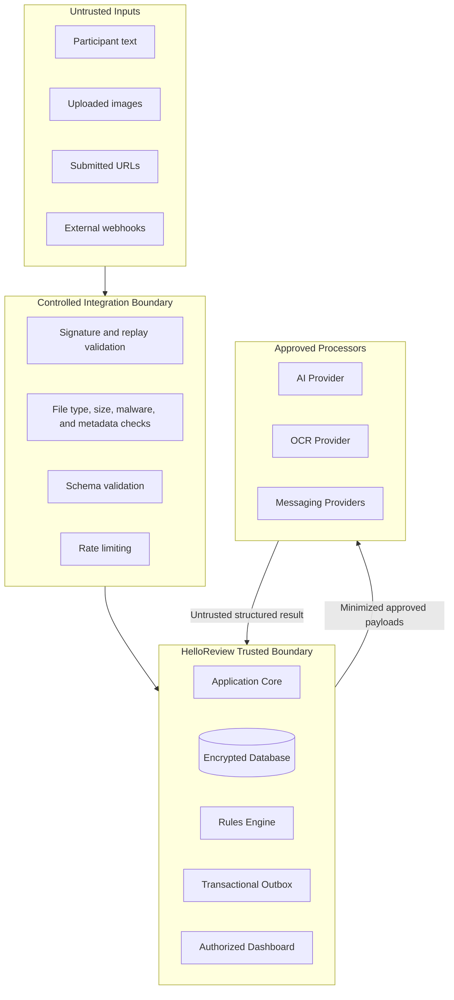
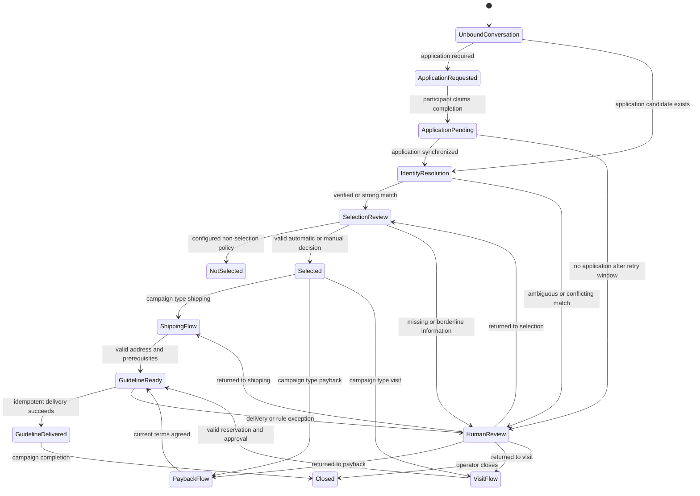

# HelloReview Reviewer Campaign Automation Platform

## Product Requirements Document

| Document field | Value |
|---|---|
| Product | HelloReview Reviewer Campaign Automation Platform |
| Selected architecture | Option 2 — Hybrid Custom Core |
| Document version | 1.0 |
| Status | Draft for discovery, validation, and approval |
| Date | August 22, 2026 |
| Timezone | Asia/Seoul |
| Product owner | HelloReview |
| Primary users | Campaign operators, campaign managers, customer-service agents, system administrators |
| Technical approach | Custom modular backend, PostgreSQL, durable job queue, official KakaoTalk integration, Aligo adapter, AI/OCR adapters, custom administration dashboard |
| Pricing basis | Estimates in South Korean won; VAT excluded unless stated otherwise |
| Legal status | Product and technical requirements only; not legal advice |

---

# 1. Executive Summary

HelloReview operates blogger and reviewer campaigns that require participants to apply through the HelloReview website, communicate through KakaoTalk, satisfy campaign-specific selection criteria, and complete shipping, payback, or reservation requirements before receiving campaign guidelines.

The current process depends heavily on operators manually:

- Finding website applications
- Matching KakaoTalk users to applicants
- Checking blog scores or internal selection criteria
- Explaining campaign methods
- Confirming addresses or payback consent
- Validating visit reservations
- Reviewing screenshots
- Preventing duplicate notifications
- Determining when campaign guidelines may be sent

The proposed product is not a generic FAQ chatbot. It is a persistent, state-aware customer-service and campaign workflow platform.

The platform will:

1. Use the HelloReview website and application database as the primary source of truth.
2. Maintain one workflow instance for each participant–application–campaign combination.
3. Match KakaoTalk conversations to website applications using deterministic identity rules.
4. Apply version-controlled selection rules.
5. Route selected participants into shipping, payback, Visit A, Visit B, or Visit C workflows.
6. Interpret Korean messages using AI without allowing AI to authorize sensitive business actions.
7. extract reservation information from screenshots using OCR and multimodal analysis.
8. Validate reservations using deterministic campaign rules.
9. Store consent, approval, reservation, address, and guideline states persistently.
10. Suppress duplicate KakaoTalk and Aligo notifications.
11. Pause automation and transfer ambiguous cases to human operators.
12. Deliver guidelines only after a deterministic readiness gate passes.
13. Maintain a complete, auditable participant timeline.
14. Recover safely from duplicate webhooks, delayed events, vendor outages, and retries.

The recommended implementation is a **modular custom application**, initially deployed as a modular monolith rather than as a large microservice platform. Critical business logic will be implemented in application services and PostgreSQL. A durable queue will handle asynchronous operations such as messaging, OCR, AI processing, retries, and reconciliation.

## 1.1 Expected business outcomes

The product is expected to:

- Reduce repetitive customer-service work
- Shorten the time from application to selection
- Reduce incorrect applicant matching
- Prevent duplicate notifications
- Eliminate premature guideline delivery
- Improve consistency across campaign types
- Give operators a complete participant timeline
- Make every automated selection and reservation decision auditable
- Allow HelloReview to launch partial automation safely before enabling higher-risk automation

## 1.2 Recommended MVP

The recommended first production release includes:

- Existing website and Aligo trigger audit
- Official KakaoTalk inbound and outbound integration proof
- Application synchronization
- Participant and application matching
- Persistent state management
- Notification ledger and duplicate suppression
- Korean intent recognition
- Human handoff
- Basic campaign administration
- Shipping workflow
- Payback consent workflow
- Visit A date and time validation
- Guideline readiness gate
- Recommendation-only selection support
- Full audit and participant timeline

Visit B screenshot automation, Visit C approval gating, and automatic selection should be introduced through controlled later phases after shadow-mode evaluation.

---

# 2. Product Principles

The product shall follow these principles.

1. **The website is the source of truth.**  
   A KakaoTalk statement cannot create an application, selection, campaign, approval, or reservation record by itself.

2. **State is persisted outside the conversation.**  
   The system must continue correctly after days of inactivity, application synchronization delays, operator intervention, or service restarts.

3. **AI interprets; deterministic services authorize.**  
   AI may identify intent, extract information, or draft a response. It must not directly select an applicant, approve a reservation, record consent, change business approval, or release guidelines.

4. **Every important action is idempotent.**  
   Duplicate events and retries must not result in duplicate messages or duplicate state transitions.

5. **Campaign rules are structured and versioned.**  
   Days, times, thresholds, approval requirements, terms, URLs, business aliases, and guideline versions must not be repeatedly inferred from text.

6. **Ambiguity stops automation.**  
   Missing, conflicting, low-confidence, suspicious, or unsupported information results in clarification or human review.

7. **Humans remain in control.**  
   Operators can pause automation, take ownership, override permitted states with a reason, return cases to automation, and activate an emergency stop.

8. **The product begins with partial automation.**  
   Higher-risk functions such as automatic selection and Visit C progression must begin in shadow or recommendation-only mode.

9. **Personal information is minimized.**  
   Only information required for the active business process should be collected, displayed, logged, or sent to AI providers.

10. **Vendor dependencies are isolated.**  
    KakaoTalk, Aligo, OCR, AI, storage, and website integrations must use internal adapters and platform-neutral event contracts.

---

# 3. Verified External Constraints

## 3.1 KakaoTalk

Kakao describes 상담톡 as an official customer-chat product supplied through official dealers and directs businesses to those dealers for detailed functions and quotations. Therefore, the exact inbound-message, attachment, webhook, agent-handoff, identifier, retry, and pricing capabilities must be verified with the selected dealer before development is committed.

Kakao’s publicly documented KakaoTalk Channel APIs cover functions such as channel addition, customer-file management, friend-relationship lookup, and add/block webhooks. The public documentation does not establish a general inbound customer-conversation feed for this use case. This PRD therefore treats an official 상담톡 provider integration as a launch dependency rather than assuming the public Channel API is sufficient.

## 3.2 Aligo

Aligo publicly documents a RESTful Alimtalk API. The current HelloReview account configuration, existing triggers, templates, result callbacks, retries, fallback messages, and suppression capabilities remain unknown and must be audited.

## 3.3 Naver Booking

Naver’s public Open API list does not identify a general Naver Booking API. The baseline product requirement is therefore screenshot-based verification unless the relevant business account or an approved Naver partner can provide a permitted booking integration. This is an inference from the currently published API catalog and must still be confirmed with Naver or the relevant partner.

## 3.4 OCR

NAVER Cloud’s CLOVA OCR supports Korean and exposes REST-based OCR capabilities. It is a suitable candidate for the technical proof of concept, but no OCR provider will be accepted without an accuracy, privacy, latency, and cost evaluation on HelloReview screenshots.

## 3.5 Korean privacy and messaging requirements

Korean privacy law provides rights concerning certain fully automated decisions that materially affect a person’s rights or obligations, including rights relating to rejection, explanation, and human review. Whether HelloReview’s campaign-selection process falls within the relevant legal category must be determined by qualified Korean counsel.

The Personal Information Protection Commission has published generative-AI privacy guidance and a revised security-measures standard effective July 1, 2026. These materials should inform AI-provider configuration, access controls, logging, retention, and privacy notices.

Korean law generally requires prior consent for commercial advertising messages, requires messages to stop after withdrawal or refusal, and imposes additional conditions on advertising messages sent between 9:00 p.m. and 8:00 a.m. Whether an individual HelloReview message is transactional or advertising must be reviewed based on its purpose and content.

---

# 4. Current-State Summary

## 4.1 Direct website applicant

Current process:

1. Participant submits an application on the HelloReview website.
2. Operator searches for the application.
3. Operator verifies name, phone number, campaign, and blog information.
4. Operator checks a blog score or internal selection criteria.
5. Operator selects, rejects, leaves pending, or escalates the application.
6. Operator provides the appropriate campaign method.
7. Operator manually handles reservations, consent, addresses, screenshots, and exceptions.

## 4.2 Secret-comment applicant

Current process:

1. HelloReview leaves a private or secret blog comment.
2. Blogger contacts the HelloReview KakaoTalk channel.
3. Operator asks the blogger to complete the website application.
4. Operator sends the application URL.
5. Blogger reports that the application is complete.
6. Operator requests a screenshot of the secret comment.
7. Operator matches the conversation, application, campaign, blog, and screenshot.
8. Operator checks selection criteria.
9. Operator provides the campaign method or escalates the case.

## 4.3 Existing Aligo behavior

At least one Aligo notification appears to be triggered when an application is completed.

The following remain unknown:

- Number of existing triggers
- Exact triggering events
- Templates and versions
- Whether selection also triggers a message
- Retry behavior
- Delivery callbacks
- Fallback-to-SMS behavior
- Whether triggers can be disabled
- Whether duplicate sending has occurred
- Whether the website or another service initiates each send

No new automated outbound workflow may enter production until this audit is complete.

## 4.4 Current bottlenecks

- Manual application lookup
- Weak identity matching
- Repeated explanations
- Manual campaign routing
- Manual reservation validation
- Manual screenshot review
- Incomplete visibility into prior messages
- Risk of duplicate notifications
- Risk of inconsistent selection decisions
- Risk of premature guideline delivery
- Lack of one participant timeline
- Lack of structured human-review tasks

---

# 5. Product Vision

Create a controlled operations platform in which every participant progresses through a transparent, persistent, and auditable campaign workflow.

A participant should receive the correct next instruction based on:

- Their verified application
- Their campaign
- Their current workflow state
- The campaign’s configured rules
- Their submitted evidence
- Human decisions
- Prior notifications
- Current guideline and terms versions

The product should feel like natural Korean customer service to participants while operating like a rules-driven case-management system internally.

---

# 6. Product Goals and Non-Goals

## 6.1 Goals

| ID | Goal |
|---|---|
| G-01 | Match KakaoTalk conversations to the correct website application using secure, deterministic evidence. |
| G-02 | Maintain participant state across conversations and days. |
| G-03 | Support direct applicants and secret-comment applicants. |
| G-04 | Apply versioned, campaign-specific selection rules. |
| G-05 | Support shipping, payback, Visit A, Visit B, and Visit C as separate workflows. |
| G-06 | Prevent booking instructions from being sent before Visit C business approval. |
| G-07 | Validate reservation business, date, time, method, status, campaign period, approval, blackout, and lead-time conditions. |
| G-08 | Store payback consent as a versioned business record. |
| G-09 | Prevent duplicate KakaoTalk and Aligo messages. |
| G-10 | Prevent guideline delivery until all prerequisites pass. |
| G-11 | Route uncertainty, exceptions, and sensitive cases to operators. |
| G-12 | Give operators a complete participant timeline and review packet. |
| G-13 | Protect names, phone numbers, addresses, conversations, blog URLs, identifiers, and screenshots. |
| G-14 | Recover safely from duplicate, delayed, missing, and out-of-order events. |
| G-15 | Allow HelloReview to expand automation gradually without rebuilding the product. |

## 6.2 Non-goals

The product will not:

- Operate as a general-purpose FAQ chatbot
- Use unofficial KakaoTalk automation
- Scrape KakaoTalk accounts or impersonate browser sessions
- Scrape blog scores from prohibited or unapproved sources
- Scrape Naver Booking
- Treat screenshot evidence as indisputable proof
- Allow AI to write directly to protected business states
- Use names alone to identify applicants
- Expose internal selection scores unless policy explicitly permits it
- Replace complaint handling or policy exceptions with automation
- Make legal determinations
- Replace the existing website as the application source of truth
- Function as a general CRM for unrelated HelloReview business processes
- Automatically accuse a participant of fraud based on image analysis
- Store personal information indefinitely

---

# 7. Users and Roles

## 7.1 Participant

A blogger or reviewer who applies for and participates in a campaign.

Participant needs:

- Clear instructions
- One next action at a time
- Fast application matching
- Specific correction explanations
- Consistent messages
- Access to a human
- Protection of personal information

## 7.2 Customer-service operator

Handles ambiguous cases, participant questions, complaints, identity issues, and workflow exceptions.

Operator needs:

- Prioritized review queue
- Participant timeline
- Masked identity details
- Application and campaign context
- Rules already evaluated
- AI/OCR output and confidence
- Suggested next action
- Ability to pause or resume automation

## 7.3 Senior operator

Handles sensitive overrides, escalations, complaints, suspicious screenshots, and complex exceptions.

## 7.4 Campaign manager

Configures campaign rules, business details, terms, guideline versions, selection thresholds, and automation settings.

## 7.5 Business-approval coordinator

Records approval, rejection, expiration, or revocation for Visit C campaigns.

## 7.6 System administrator

Manages users, permissions, integrations, secrets, environments, monitoring, retries, and emergency controls.

## 7.7 Privacy or security reviewer

Reviews personal-data handling, retention, AI-provider configuration, access logs, data requests, and incidents.

## 7.8 Auditor

Receives read-only access to decisions, configuration versions, messages, and state transitions.

---

# 8. Confirmed Facts, Assumptions, and Unknowns

| Item | Status | Impact | Verification method | Owner | Decision point |
|---|---|---|---|---|---|
| Website application is the source of truth | Confirmed business requirement | Controls all matching and selection workflows | Product-owner approval | Product owner | Before architecture sign-off |
| Direct and secret-comment acquisition paths exist | Confirmed | Requires separate entry workflows | Current-process walkthrough | CS operations | Discovery |
| Shipping, payback, and visit campaigns exist | Confirmed | Requires separate workflow dimensions | Campaign inventory | Campaign manager | Discovery |
| Visit A, B, and C are distinct | Confirmed | Requires separate instructions and guards | Campaign inventory | Campaign manager | Discovery |
| Existing application-completion Aligo notification exists | Assumed from current observation | Duplicate-message risk | Trigger and code audit | Website developer | Phase 0 |
| Exact Aligo trigger count | Unknown | Launch blocker for outbound automation | Logs, source code, Aligo account review | Website developer | Phase 0 |
| Website API is available | Unknown | May change integration cost and latency | Technical review | Website developer | Week 2 |
| Website webhooks are available | Unknown | Affects real-time matching | Technical review | Website developer | Week 2 |
| Direct database access is permitted | Unknown | Determines fallback integration | Security and technical review | Website owner | Week 2 |
| Official inbound KakaoTalk API is available | Unknown | Critical integration blocker | 상담톡 dealer proof of concept | Integration lead | Week 3 |
| Kakao attachment events are available | Unknown | Required for screenshot workflows | Dealer proof of concept | Integration lead | Week 3 |
| Stable Kakao user and conversation IDs are available | Unknown | Required for identity persistence and deduplication | Dealer documentation and test | Integration lead | Week 3 |
| Aligo delivery callbacks are available for the account | Unknown | Affects reconciliation | Aligo test account | Integration lead | Week 3 |
| Approved blog-score API exists | Unknown | Auto-selection may be impossible without it | Contract and provider review | Product owner | Before selection automation |
| Blog-score automation is permitted | Unknown | Legal and contractual risk | Provider terms and legal review | Legal/privacy | Before selection automation |
| General Naver Booking API is available | Not confirmed; public catalog does not identify one | Screenshot flow remains baseline | Naver or partner confirmation | Integration lead | Before Visit B/C design freeze |
| Expected monthly volume | Unknown | Affects infrastructure and vendor plan | Historical data analysis | Product owner | Discovery |
| Active campaign count | Unknown | Affects administration design | Campaign inventory | Campaign manager | Discovery |
| Operator count and service hours | Unknown | Affects queue and SLA design | Operations workshop | CS manager | Discovery |
| Korean hosting is mandatory | Unknown | Affects provider selection | Privacy and legal review | Privacy reviewer | Architecture sign-off |
| Overseas AI processing is permitted | Unknown | May limit model vendors | Privacy notice, consent, and DPA review | Privacy reviewer | Before AI provider selection |
| Retention periods | Unknown | Affects database and file lifecycle | Legal and policy review | Privacy reviewer | Before production |
| Automatic selection legal treatment | Requires legal review | May require disclosures, explanation, or human review | Korean legal counsel | Product owner | Before auto-selection |
| Non-selection message policy | Unknown | Cannot invent rejection messaging | Company policy decision | Product owner | Before UAT |
| Campaign rule-change approval process | Unknown | Misconfiguration risk | Governance workshop | Product owner | Before admin development |
| Budget and launch date | Unknown | Affects scope and staffing | Executive decision | Sponsor | Discovery exit |

---

# 9. Scope and Release Boundaries

## 9.1 Full product scope

The full target product includes:

- Website application synchronization
- KakaoTalk inbound and outbound communication
- Aligo outbound communication
- Participant identity resolution
- Direct-applicant workflows
- Secret-comment workflows
- Selection recommendation and controlled automatic selection
- Shipping address collection and validation
- Versioned payback consent
- Visit A reservation validation
- Visit B screenshot extraction and validation
- Visit C business approval and reservation gating
- Guideline readiness and delivery
- Human task management
- Campaign administration
- Participant timeline
- Notification deduplication
- Audit logging
- Security and privacy controls
- Monitoring, retries, reconciliation, and recovery

## 9.2 MVP scope

The MVP shall include:

| Capability | MVP treatment |
|---|---|
| Website integration | Required |
| KakaoTalk official integration | Required |
| Aligo audit and adapter | Required |
| Application matching | Required |
| Direct-applicant flow | Required |
| Secret-comment claim and screenshot intake | Required |
| Secret-comment automated verification | Recommendation only |
| Selection | Recommendation only by default |
| Shipping workflow | Required |
| Payback workflow | Required |
| Visit A | Required |
| Visit B | Image intake and operator-assisted extraction; full automation may follow |
| Visit C | Approval state and hard message gate required; full screenshot automation may follow |
| Guideline gate | Required |
| Duplicate suppression | Required |
| Human handoff | Required |
| Participant timeline | Required |
| Campaign editor | Required basic version |
| Advanced analytics | Later phase |
| Multi-provider AI routing | Later phase |
| Multi-region disaster recovery | Later phase |

## 9.3 Out-of-scope for MVP

- Fully automatic rejection across all campaigns
- Fully automatic suspicious-image determination
- Direct Naver Booking integration without an approved interface
- Blog-score collection without approved access
- Automatic resolution of complaints
- Advanced workforce forecasting
- Full omnichannel support beyond KakaoTalk and Aligo
- Custom mobile application
- General marketing automation

---

# 10. Proposed Architecture

## 10.1 Architecture style

The product will begin as a **modular monolith** with clearly separated modules.

This means:

- One primary backend deployment can contain multiple domain modules.
- Modules communicate through defined internal interfaces.
- PostgreSQL provides the primary transactional state store.
- Durable background jobs handle asynchronous work.
- External providers are hidden behind adapters.
- Individual modules may be extracted into services later if volume or reliability needs justify it.

This avoids the fragility of placing critical logic in low-code workflows while also avoiding premature microservice complexity.

## 10.2 Component diagram

```mermaid
flowchart LR
    Participant[Participant] --> Kakao[KakaoTalk Channel]
    Kakao --> Provider[Official 상담톡 Provider]
    Provider --> Gateway[Webhook and API Gateway]

    Website[HelloReview Website] --> Gateway
    WebsiteDB[(Website Application Store)] --> WebsiteAdapter[Website Adapter]
    WebsiteAdapter --> Core

    Gateway --> Inbox[(Event Inbox)]
    Inbox --> Core[HelloReview Automation Core]

    subgraph CoreModules[Modular Application Core]
        Identity[Identity Resolution]
        Workflow[Workflow and State Machine]
        Rules[Campaign Rules Engine]
        Reservation[Reservation Validation]
        Consent[Consent and Approval]
        Notification[Notification Service]
        Human[Human Task Service]
        AIOrchestrator[AI and OCR Orchestrator]
        Audit[Audit Service]
    end

    Core --> MainDB[(PostgreSQL)]
    Core --> Queue[Durable Job Queue]
    Queue --> Workers[Background Workers]

    Workers --> AI[Language Model Provider]
    Workers --> OCR[OCR or Multimodal Provider]
    Workers --> Storage[(Encrypted Object Storage)]
    Workers --> Aligo[Aligo]
    Workers --> Provider

    Admin[Operator Dashboard] --> AdminAPI[Admin API]
    AdminAPI --> Core

    Core --> Monitoring[Logs, Metrics, Alerts]
```



## 10.3 Event-processing flow



## 10.4 Guideline-readiness flow



## 10.5 Human-handoff flow



## 10.6 Trust boundaries



---

# 11. Component Responsibilities

| Component | Responsibility | Receives | Produces | Failure behavior | Security requirements | Release |
|---|---|---|---|---|---|---|
| Webhook gateway | Validate, normalize, and accept events | Provider webhooks | Internal event envelope | Reject invalid signatures; acknowledge duplicates | Signature validation, replay protection, rate limiting | MVP |
| Event inbox | Deduplicate inbound events | Internal events | Processable event record | Retain failed events for replay | Unique provider/event constraint | MVP |
| Website adapter | Read and synchronize application data | Website API, webhook, or approved database feed | Application events and snapshots | Retry; reconcile; block auto-selection if stale | Read/write scopes separated | MVP |
| Kakao adapter | Translate provider messages and attachments | 상담톡 provider API | Internal message and attachment events | Pause affected channel on prolonged outage | Provider keys, signature validation | MVP |
| Aligo adapter | Send and reconcile Aligo messages | Notification intents | Provider message ID and delivery state | Idempotent retry; fallback only by policy | Restricted API credentials | MVP |
| Identity service | Match channel identity to participant/application | Application candidates and verification evidence | Match status and link | Human review for ambiguity | No LLM record selection | MVP |
| Workflow service | Control business state transitions | Events and commands | New state and workflow events | Reject stale or illegal transition | Optimistic locking, authorization | MVP |
| Rules engine | Evaluate configured deterministic rules | Structured facts and rule version | Pass/fail/review result | Return configuration error; no guessing | Versioned rules, access control | MVP |
| Selection module | Evaluate selection policy | Application, score, rule | Decision recommendation or authorized result | Human review if unavailable or borderline | Immutable decision evidence | MVP recommendation; later auto |
| Reservation service | Validate structured reservation | Reservation fields and campaign rules | Rule-level result | Correction or human review | No raw AI authorization | MVP for Visit A; later B/C |
| AI orchestrator | Classify and extract unstructured input | Text or approved image reference | Structured output | Retry/fallback/human review | Payload minimization, schema validation | MVP |
| Attachment service | Securely ingest and manage files | Kakao attachments | Safe object reference and metadata | Reject unsafe files | Malware scanning, isolation, encryption | MVP |
| Notification service | Create and send deduplicated messages | Message intent | Outbox and delivery records | Controlled retries | Unique dedupe constraints | MVP |
| Human-task service | Manage operator review work | Handoff event | Task, priority, assignment | Escalate overdue tasks | Masked data and role controls | MVP |
| Admin API | Expose authorized operations | Dashboard commands | Validated business commands | Reject unauthorized or stale changes | RBAC, audit, CSRF protection | MVP |
| Admin dashboard | Campaign and participant operations | Admin API | User actions | Read-only fallback during partial outage | SSO/MFA where available | MVP |
| Audit service | Preserve decision and access evidence | State and admin events | Immutable audit records | Alert if logging fails for sensitive actions | Append-only controls | MVP |
| Monitoring | Detect failures and policy violations | Logs, metrics, traces | Alerts and dashboards | Escalate critical incidents | No unnecessary PII | MVP |

---

# 12. Integration Feasibility Matrix

| System | Required capability | Official path | Authentication | Reads | Writes | Webhooks | Known constraint | Verification status | Fallback | Blocker |
|---|---|---|---|---|---|---|---|---|---|---|
| HelloReview website | Application creation/update and campaign data | Website-owned API or approved data integration | Service account, signed token, or mTLS | Applications, campaigns, statuses | Selection/status where permitted | Preferred | Current stack unknown | Unknown | Scheduled reconciliation or approved read-only database replica | Yes |
| Application database | Reliable source-of-truth access | Through website service boundary | Database role or service API | Required | Limited | Not applicable | Direct access may increase coupling | Unknown | Export/import bridge | Yes |
| KakaoTalk | Inbound text, images, IDs, outbound replies, agent takeover | Official 상담톡 dealer | Provider-defined; must be verified | Conversations and attachments | Replies | Required | Public Channel API alone is not assumed sufficient | Requires vendor proof | Manual 상담톡 console | Yes |
| Aligo | Alimtalk send, result, template identification, retry coordination | Official Aligo API | Provider API credentials | Balance, templates, results where supported | Send | Requires confirmation | Existing trigger behavior unknown | Partial | Manual sending or controlled SMS fallback by policy | Yes |
| Blog-score source | Approved score retrieval | Provider API or authorized import | Provider-defined | Score and timestamp | Usually none | Optional | Scraping prohibited unless explicitly permitted | Unknown | Operator import or review | Yes for auto-selection |
| Naver Booking | Reservation confirmation | Approved partner/account integration if available | Provider-defined | Reservation details | Not required | Unknown | No general public Booking API established by current public catalog | Unconfirmed | Screenshot verification | No for screenshot model |
| AI provider | Korean intent and structured extraction | Approved API | API key or cloud identity | Not applicable | Inference request | Not applicable | Retention and overseas processing must be reviewed | PoC required | Secondary model or human review | Yes before production AI |
| OCR provider | Korean screenshot text extraction | CLOVA OCR or approved alternative | Cloud API credentials | Not applicable | OCR request | Not applicable | Layout and screenshot quality vary | PoC required | Multimodal model or human review | Yes for Visit B/C |
| File storage | Encrypted private image storage | Approved cloud object storage | Workload identity | Objects and metadata | Objects and lifecycle | Events optional | Public access must be disabled | Design selection required | Encrypted local quarantine for outage | Yes |
| Operator dashboard | Campaign and case administration | Custom application | SSO/MFA or secure account | Operational data | Authorized commands | Internal events | Existing dashboard unknown | Unknown | Provider console plus restricted support tool | No for pilot; yes for production |

---

# 13. Functional Requirements

Priorities:

- **P0:** Mandatory for safe launch
- **P1:** Required for full target product
- **P2:** Valuable enhancement

## 13.1 Application and source-of-truth requirements

| ID | Priority | Requirement | Acceptance condition |
|---|---:|---|---|
| FR-APP-001 | P0 | The website application record shall remain the authoritative application source. | No participant message can create an application-completed state without a website event or authorized reconciliation result. |
| FR-APP-002 | P0 | Every application shall have a stable application ID. | Repeated synchronization updates the same record rather than creating duplicates. |
| FR-APP-003 | P0 | The system shall preserve the source event ID and source timestamp for application changes. | Duplicate website events produce one logical state change. |
| FR-APP-004 | P0 | The system shall distinguish application received, completed, matched, ambiguous, cancelled, and synchronized-late states. | Each state is visible in the participant timeline. |
| FR-APP-005 | P0 | The system shall reconcile recent website applications when a participant claims to have applied but no event has arrived. | A configurable retry window occurs before declaring no match. |
| FR-APP-006 | P0 | The system shall support duplicate website applications. | Duplicates are linked, resolved, or transferred for review without silently deleting records. |
| FR-APP-007 | P0 | The system shall support one participant having several active applications. | Each application has an independent workflow instance. |
| FR-APP-008 | P1 | Website synchronization shall expose freshness and last successful reconciliation time. | Auto-selection is blocked when required application data is stale. |

## 13.2 Identity-matching requirements

| ID | Priority | Requirement | Acceptance condition |
|---|---:|---|---|
| FR-ID-001 | P0 | Name-only matching shall be prohibited. | A name-only candidate is classified as weak and cannot bind a participant. |
| FR-ID-002 | P0 | Matching shall use deterministic evidence such as application ID, verification token, normalized phone, campaign, blog URL, or authorized verification. | Match record contains method, evidence, category, and timestamp. |
| FR-ID-003 | P0 | A unique application verification token shall be supported where the website can provide one. | Valid token links only to its intended application and expires according to policy. |
| FR-ID-004 | P0 | Phone numbers shall be normalized before comparison. | Korean local and international representations normalize consistently. |
| FR-ID-005 | P0 | A phone number shall not be globally unique because shared numbers may exist. | Multiple records using one number are handled as candidates, not overwritten. |
| FR-ID-006 | P0 | Several matching applications shall result in an ambiguous state. | The system asks for safe additional verification or creates a human task. |
| FR-ID-007 | P0 | Candidate applicant names or details shall never be listed to a participant. | Responses reveal no other applicant information. |
| FR-ID-008 | P0 | The language model shall not select the database record. | Server-side identity service chooses from validated candidates. |
| FR-ID-009 | P0 | A verified Kakao channel identity shall be persisted. | Future conversations can reuse the link subject to campaign context and security policy. |
| FR-ID-010 | P0 | A conversation involving several active campaigns shall require campaign disambiguation. | No campaign-specific state changes occur until context is resolved. |
| FR-ID-011 | P1 | Phone-number changes shall use a controlled re-verification process. | Old and new values, actor, reason, and timestamp are recorded. |
| FR-ID-012 | P0 | Every identity result shall use one of: Verified, Strong Match, Weak Match, Ambiguous, or No Match. | Unconstrained AI confidence alone is never stored as the identity result. |

## 13.3 Secret-comment requirements

| ID | Priority | Requirement | Acceptance condition |
|---|---:|---|---|
| FR-SC-001 | P0 | The system shall recognize semantically similar Korean secret-comment claims. | Approved test expressions are classified without requiring an exact keyword. |
| FR-SC-002 | P0 | A secret-comment claimant who has not applied shall receive the application URL before selection review. | Workflow remains application-requested until website completion is confirmed. |
| FR-SC-003 | P0 | The system shall request a screenshot after application completion according to campaign policy. | Screenshot request is sent once per applicable workflow and template version. |
| FR-SC-004 | P0 | A secret-comment screenshot shall be supporting evidence, not identity proof. | Screenshot alone cannot bind an application or select the participant. |
| FR-SC-005 | P1 | OCR or AI may extract campaign, blog, and visible comment evidence. | Output follows a schema and includes confidence and missing fields. |
| FR-SC-006 | P0 | Unclear, conflicting, cropped, or suspicious screenshots shall be retried or reviewed by a human. | No verified state is created from insufficient evidence. |
| FR-SC-007 | P0 | Instructions embedded in a screenshot shall be ignored. | Image text cannot alter system policy or tool access. |

## 13.4 Selection requirements

| ID | Priority | Requirement | Acceptance condition |
|---|---:|---|---|
| FR-SEL-001 | P0 | Selection criteria shall be stored as versioned campaign rules. | Every decision references one immutable rule version. |
| FR-SEL-002 | P0 | Automatic selection shall be disabled by default for new campaigns. | A campaign manager must explicitly enable it. |
| FR-SEL-003 | P0 | Automatic selection shall require verified or policy-approved strong identity. | Weak or ambiguous identity blocks automatic selection. |
| FR-SEL-004 | P0 | Automatic selection shall require complete and fresh input data. | Missing score, stale score, missing threshold, or unavailable source creates review. |
| FR-SEL-005 | P0 | The system shall store the input values, threshold, rule version, result, reason, component, and time. | An auditor can reconstruct the decision. |
| FR-SEL-006 | P0 | Borderline values shall use a configurable manual-review band. | Values within the band cannot be automatically selected or rejected. |
| FR-SEL-007 | P0 | Clearly failing applicants shall follow a configured policy. | No rejection message is invented when the campaign policy is absent. |
| FR-SEL-008 | P0 | Internal scoring details shall not be disclosed unless policy permits. | Participant templates contain no internal score variable by default. |
| FR-SEL-009 | P0 | The AI shall not generate or change thresholds. | Threshold changes require an authorized dashboard command. |
| FR-SEL-010 | P0 | A manual override shall require an actor, reason, previous result, and new result. | Sensitive overrides appear in the audit log. |
| FR-SEL-011 | P1 | Automatic selection shall begin in shadow mode. | Recommendations are measured against human decisions before activation. |
| FR-SEL-012 | P0 | Revoking a prior selection shall stop downstream automation. | Open reservation and guideline actions are paused and reviewed. |

## 13.5 Campaign configuration and routing requirements

| ID | Priority | Requirement | Acceptance condition |
|---|---:|---|---|
| FR-CAM-001 | P0 | Campaign type shall be stored as Shipping, Payback, or Visit. | Routing never depends on repeated free-text interpretation. |
| FR-CAM-002 | P0 | Visit method shall be stored as A, B, or C. | Visit-specific instructions use the configured method. |
| FR-CAM-003 | P0 | Campaign status, dates, allowed weekdays, time windows, blackouts, and lead time shall be structured. | Reservation validator consumes structured fields. |
| FR-CAM-004 | P0 | Business name, aliases, branch, phone, and booking URL shall be versioned. | Changes are effective-dated and auditable. |
| FR-CAM-005 | P0 | Payback terms and guidelines shall have immutable versions. | Consent and delivery reference exact versions. |
| FR-CAM-006 | P0 | Campaign rules shall be validated before activation. | Missing required configuration prevents the campaign from entering automated mode. |
| FR-CAM-007 | P0 | Rule changes affecting active participants shall define whether old or new rules apply. | No silent retroactive rule application occurs. |
| FR-CAM-008 | P1 | Sensitive configuration changes shall support maker-checker approval. | Threshold, Visit C approval rules, and guideline gates can require secondary approval. |

## 13.6 Shipping requirements

| ID | Priority | Requirement | Acceptance condition |
|---|---:|---|---|
| FR-SHP-001 | P0 | Shipping information shall be requested only after selection. | Unselected participants cannot enter address-valid state. |
| FR-SHP-002 | P0 | A secure one-time web form shall be the preferred collection method. | Address information is not unnecessarily repeated in KakaoTalk. |
| FR-SHP-003 | P0 | Required address fields shall be campaign-configurable. | Missing fields produce a specific correction request. |
| FR-SHP-004 | P0 | Phone and postal-code formats shall receive deterministic validation. | Invalid formats do not reach address-valid state. |
| FR-SHP-005 | P0 | Valid addresses shall not be requested repeatedly. | Duplicate address requests are suppressed. |
| FR-SHP-006 | P0 | Address changes shall be allowed before a campaign cutoff. | Actor, time, old version, and new version are recorded. |
| FR-SHP-007 | P0 | Address data shall be masked in normal dashboards and logs. | Only authorized roles can reveal full values. |
| FR-SHP-008 | P0 | Cross-participant address exposure shall be prevented. | Authorization tests show no access outside the owning workflow. |
| FR-SHP-009 | P1 | The system shall support address locking after fulfillment cutoff. | Changes after locking require human review. |

## 13.7 Payback requirements

| ID | Priority | Requirement | Acceptance condition |
|---|---:|---|---|
| FR-PAY-001 | P0 | Campaign-specific payback terms shall be sent using a versioned template. | The terms version is recorded in the consent request. |
| FR-PAY-002 | P0 | Consent shall require an explicit response associated with the active request. | A prior or unrelated “yes” cannot satisfy current consent. |
| FR-PAY-003 | P0 | Consent states shall include Not Requested, Awaiting Response, Agreed, Declined, Withdrawn, and Human Review Required. | Every payback workflow has exactly one current state. |
| FR-PAY-004 | P0 | Ambiguous consent shall result in one clarification request. | No agreed state is recorded from an ambiguous response. |
| FR-PAY-005 | P0 | Declined consent shall stop progression. | No guideline or payback continuation message is sent. |
| FR-PAY-006 | P0 | Consent shall store terms version, response text classification, timestamp, channel, and evidence message ID. | Audit record reconstructs the consent. |
| FR-PAY-007 | P0 | Terms changes shall invalidate uncompleted consent requests. | New terms require a new response. |
| FR-PAY-008 | P1 | Consent withdrawal shall follow company policy and create a review where fulfillment has begun. | Withdrawal is not silently ignored. |

## 13.8 Visit A requirements

| ID | Priority | Requirement | Acceptance condition |
|---|---:|---|---|
| FR-VA-001 | P0 | The system shall send the configured business phone number after selection. | Correct campaign and business version are recorded. |
| FR-VA-002 | P0 | The participant shall be asked to report the confirmed date and time. | One clear next action is present in the message. |
| FR-VA-003 | P0 | Korean natural-language dates and times shall be extracted. | Result includes normalized Asia/Seoul timestamp and source text. |
| FR-VA-004 | P0 | Ambiguous relative dates shall be clarified. | “Next Friday” or incomplete dates are not silently assumed where multiple interpretations exist. |
| FR-VA-005 | P0 | Deterministic rules shall validate date, weekday, time, period, blackouts, and lead time. | Each failed rule contains submitted and expected values. |
| FR-VA-006 | P0 | Wrong reservation method shall be detected. | A phone reservation for a Naver-only campaign cannot pass. |
| FR-VA-007 | P0 | Guidelines shall be blocked until reservation-valid state. | Guideline gate cannot be bypassed by participant request. |

## 13.9 Visit B requirements

| ID | Priority | Requirement | Acceptance condition |
|---|---:|---|---|
| FR-VB-001 | P1 | The system shall send the configured Naver booking instructions. | Purpose and template version are recorded. |
| FR-VB-002 | P1 | The system shall securely receive and store reservation screenshots. | File passes type, size, malware, and ownership validation. |
| FR-VB-003 | P1 | The extraction pipeline shall return business, date, time, status, method, holder where required, confidence, missing fields, conflicts, and image quality. | Server rejects output that does not match the schema. |
| FR-VB-004 | P1 | Business names shall be compared against the campaign business and approved aliases. | Wrong branch or unapproved alias fails validation. |
| FR-VB-005 | P1 | Reservation status shall indicate completion rather than an unfinished booking. | In-progress or uncertain status cannot pass. |
| FR-VB-006 | P1 | Low-confidence or incomplete screenshots shall trigger a clear re-upload request or human review. | No low-confidence auto-pass occurs. |
| FR-VB-007 | P1 | Replacement screenshots shall create new reservation versions. | Previous evidence remains auditable and superseded. |
| FR-VB-008 | P0 | Text embedded in screenshots shall be treated only as untrusted content. | It cannot trigger tools, database changes, or policy overrides. |

## 13.10 Visit C requirements

| ID | Priority | Requirement | Acceptance condition |
|---|---:|---|---|
| FR-VC-001 | P0 | Visit C shall have a business-approval state independent from reservation state. | Approval can be audited separately. |
| FR-VC-002 | P0 | Booking instructions shall never be sent while approval is not requested, pending, expired, rejected, revoked, or under review. | Automated test confirms zero sends in prohibited states. |
| FR-VC-003 | P0 | Approval shall be recorded only by an authorized source or operator. | Participant messages cannot approve the business visit. |
| FR-VC-004 | P0 | Approval shall record campaign, participant/application scope, approver, time, and expiry where applicable. | Approval cannot be reused outside its scope. |
| FR-VC-005 | P0 | The approved booking message shall be deduplicated. | Duplicate approval events cause one instruction message. |
| FR-VC-006 | P0 | Approval revocation shall pause progression and create a human task. | No further automatic booking or guideline messages occur. |
| FR-VC-007 | P1 | After approval, Visit B screenshot validation rules shall apply. | Reservation must pass before guidelines are released. |
| FR-VC-008 | P0 | Booking performed before approval shall be transferred for review. | The system does not retroactively declare it valid without policy approval. |

## 13.11 Reservation-validation requirements

| ID | Priority | Requirement | Acceptance condition |
|---|---:|---|---|
| FR-RES-001 | P0 | Reservation validation shall use structured campaign values. | No free-form prompt defines the rule. |
| FR-RES-002 | P0 | Expected campaign and business shall match. | Wrong campaign, business, or branch fails. |
| FR-RES-003 | P0 | Reservation date shall fall within campaign dates. | Outside-period reservations fail. |
| FR-RES-004 | P0 | Weekday and time-window rules shall support multiple windows by weekday. | All configured windows are evaluated. |
| FR-RES-005 | P0 | Boundary inclusion shall be configurable. | Exact start and end times are tested. |
| FR-RES-006 | P0 | Public holidays and blackout dates shall be supported. | Configured restricted dates fail. |
| FR-RES-007 | P0 | Minimum advance notice shall be supported. | Insufficient lead time fails. |
| FR-RES-008 | P0 | Visit method and business approval shall be checked. | Visit C cannot pass without current approval. |
| FR-RES-009 | P0 | Reservation status shall be complete and current. | Cancelled, replaced, or incomplete reservations fail. |
| FR-RES-010 | P0 | Rescheduling and cancellation shall create history rather than overwrite evidence. | Prior versions remain visible. |
| FR-RES-011 | P0 | Every failure shall include rule, submitted value, expected condition, correction, retry eligibility, and review requirement. | Participant receives a specific approved explanation. |
| FR-RES-012 | P1 | Capacity or participant-specific restrictions shall be supported when configured. | Missing capacity integration causes review rather than assumption. |

## 13.12 Guideline requirements

| ID | Priority | Requirement | Acceptance condition |
|---|---:|---|---|
| FR-GDL-001 | P0 | Guidelines shall be delivered only after a deterministic readiness predicate passes. | Participant requests alone cannot trigger delivery. |
| FR-GDL-002 | P0 | Each campaign type shall have its own readiness predicate. | Shipping, payback, Visit A, B, and C are evaluated separately. |
| FR-GDL-003 | P0 | Every delivery shall store participant, application, campaign, guideline version, channel, event, rule result, timestamp, provider result, and dedupe key. | Audit query reconstructs every delivery. |
| FR-GDL-004 | P0 | A previously delivered version shall not be resent automatically. | Duplicate request creates a suppression record. |
| FR-GDL-005 | P0 | Re-delivery shall require a new guideline version, authorized operator action, or confirmed delivery failure. | Unapproved re-delivery is rejected. |
| FR-GDL-006 | P0 | Premature guideline delivery shall be classified as a critical incident. | Alert and automation pause are triggered. |
| FR-GDL-007 | P0 | Cancellation or approval revocation after delivery shall create a review task. | Operators receive the full delivery and state history. |

## 13.13 Messaging and deduplication requirements

| ID | Priority | Requirement | Acceptance condition |
|---|---:|---|---|
| FR-MSG-001 | P0 | Every inbound provider event shall have a unique source and external event ID. | Duplicate webhook creates no duplicate processing. |
| FR-MSG-002 | P0 | Every outbound message shall have a message-purpose code. | Logs can distinguish application, selection, consent, reservation, holding, and guideline messages. |
| FR-MSG-003 | P0 | Every outbound message shall use an idempotency and deduplication key. | A database unique constraint prevents duplicates. |
| FR-MSG-004 | P0 | Outbound sends shall use a transactional outbox. | State and send intent commit together. |
| FR-MSG-005 | P0 | Existing Aligo triggers shall be audited before launch. | Audit report and migration decision are approved. |
| FR-MSG-006 | P0 | Human and automated ownership shall be mutually exclusive for a conversation. | Human takeover prevents automated messages except approved system notices. |
| FR-MSG-007 | P0 | Delayed and out-of-order events shall be tolerated. | Stale events cannot reverse a newer valid state without an explicit correction. |
| FR-MSG-008 | P0 | Retries shall reuse the original idempotency key. | Provider timeout does not create a second logical message. |
| FR-MSG-009 | P0 | Delivery status shall be reconciled. | Unknown status is periodically checked or assigned for review. |
| FR-MSG-010 | P1 | Quiet hours and communication preferences shall be configurable. | Non-urgent messages are scheduled according to policy. |
| FR-MSG-011 | P0 | Opt-out status shall be enforced where applicable. | Prohibited messages are suppressed with a reason. |
| FR-MSG-012 | P0 | Transactional and advertising templates shall be classified separately. | Legal-approved policy determines consent and timing requirements. |

## 13.14 Human-handoff requirements

| ID | Priority | Requirement | Acceptance condition |
|---|---:|---|---|
| FR-HUM-001 | P0 | Participants may request a human at any time. | The request immediately pauses ordinary automation. |
| FR-HUM-002 | P0 | Complaints shall be routed to human review. | Complaint intent does not receive an automated substantive decision. |
| FR-HUM-003 | P0 | Handoff shall create a structured case packet. | Packet includes state, masked identity, application, campaign, summary, evidence, rules, actions, priority, and recommendation. |
| FR-HUM-004 | P0 | A holding message shall be sent at most once per handoff episode and version. | Duplicate triggers do not repeat the holding message. |
| FR-HUM-005 | P0 | Operators shall take explicit ownership. | Ownership actor and timestamp are visible. |
| FR-HUM-006 | P0 | Operators shall return a case to automation only after state validation. | Invalid or incomplete state cannot resume. |
| FR-HUM-007 | P0 | Sensitive overrides shall require a reason. | Empty override reason is rejected. |
| FR-HUM-008 | P0 | An emergency automation kill switch shall exist. | Authorized activation stops all non-essential outbound automation. |
| FR-HUM-009 | P1 | Review queues shall support priority, age, campaign, reason, and assignee filters. | Operators can identify overdue and critical work. |

## 13.15 Administrative requirements

| ID | Priority | Requirement | Acceptance condition |
|---|---:|---|---|
| FR-ADM-001 | P0 | The dashboard shall show a complete participant timeline. | Operators can understand the case without reading every message first. |
| FR-ADM-002 | P0 | Campaign managers shall configure campaign type and visit method. | Invalid combinations are rejected. |
| FR-ADM-003 | P0 | Campaign managers shall configure allowed days, times, blackouts, dates, lead time, aliases, phone, and booking URL. | Effective version is auditable. |
| FR-ADM-004 | P0 | Authorized users shall manage selection rules and automation flags. | Unauthorized roles cannot change thresholds. |
| FR-ADM-005 | P0 | Authorized users shall manage payback terms, message templates, and guideline versions. | Publishing creates an immutable version. |
| FR-ADM-006 | P0 | Operators shall manage business approval and human tasks. | Approval changes require appropriate role and scope. |
| FR-ADM-007 | P0 | Failed jobs and retry controls shall be available. | Retry retains the original idempotency context. |
| FR-ADM-008 | P0 | Notification history and suppression reasons shall be visible. | Operator can explain why a message did or did not send. |
| FR-ADM-009 | P0 | Audit logs shall be searchable by participant, application, campaign, actor, and event. | Sensitive access is itself audited. |
| FR-ADM-010 | P0 | Automation can be paused globally, by campaign, by workflow type, or by participant. | Pause level is clearly displayed. |
| FR-ADM-011 | P1 | Rule changes shall support preview against test cases. | Campaign cannot activate with failing validation examples. |
| FR-ADM-012 | P1 | Dashboard data exports shall be permission-controlled and logged. | Bulk PII export is restricted. |

---

# 14. Business-State Model

## 14.1 Workflow-instance boundary

A workflow instance is scoped to:

```text
participant_id + application_id + campaign_id
```

A participant may have several simultaneous workflow instances.

Consent, reservation, approval, shipping address, guideline delivery, and selection state must never be shared across workflow instances unless an explicit business rule allows it.

## 14.2 State dimensions

| Dimension | States |
|---|---|
| Application | Not Applied, Application Requested, Application Pending, Application Completed, Application Matched, Match Ambiguous, Application Cancelled |
| Selection | Not Reviewed, Review Pending, Auto-Selected, Manually Selected, Not Selected, Human Review Required |
| Campaign type | Shipping, Payback, Visit |
| Visit method | Not Applicable, Visit A, Visit B, Visit C |
| Secret comment | Not Claimed, Claimed, Screenshot Requested, Screenshot Received, Verified, Rejected, Human Review Required |
| Payback consent | Not Applicable, Not Requested, Awaiting Response, Agreed, Declined, Withdrawn, Human Review Required |
| Business approval | Not Required, Not Requested, Pending, Approved, Rejected, Expired, Revoked, Human Review Required |
| Shipping | Not Applicable, Address Requested, Address Received, Address Incomplete, Address Valid, Address Change Requested, Locked |
| Reservation | Not Applicable, Not Started, Instructions Sent, Awaiting Participant, Information Received, Screenshot Received, Extraction Pending, Validation Pending, Valid, Correction Required, Cancelled, Rescheduled, Human Review Required |
| Guideline | Not Ready, Ready, Delivery Queued, Delivered, Delivery Failed, Suppressed as Duplicate, Re-delivery Authorized |
| Human handoff | Not Required, Requested, Queued, Assigned, In Progress, Resolved, Returned to Automation, Closed |
| Automation mode | Active, Paused by Rule, Paused for Human, Human Owned, Campaign Paused, Globally Paused, Closed |

## 14.3 High-level lifecycle



## 14.4 Mandatory transition controls

Every transition shall include:

- Workflow ID
- Expected workflow version
- Current state
- Requested target state
- Triggering event ID
- Actor or system component
- Preconditions
- Rule version where relevant
- Decision reason
- Side effects
- Timestamp
- Correlation ID

The state update shall use optimistic concurrency control.

A transition based on an outdated workflow version shall fail with a stale-version conflict and be re-evaluated against the current state.

## 14.5 Critical transition table

| Dimension | From | Trigger | To | Mandatory guard | Side effect |
|---|---|---|---|---|---|
| Application | Not Applied | Initial applicant contact | Application Requested | Campaign application URL exists | Queue application-request message |
| Application | Application Requested | Participant says completed | Application Pending | No confirmed application yet | Run reconciliation |
| Application | Application Pending | Website confirms application | Application Completed | Valid application event | Begin identity matching |
| Application | Application Completed | Identity verified | Application Matched | Deterministic match approved | Persist channel link |
| Application | Application Completed | Multiple or conflicting candidates | Match Ambiguous | Candidate conflict | Create human task |
| Selection | Not Reviewed | Application matched | Review Pending | Campaign active | Load selection rule |
| Selection | Review Pending | Automatic rule passes | Auto-Selected | Auto enabled, data fresh, identity approved, outside manual band | Route campaign |
| Selection | Review Pending | Operator selects | Manually Selected | Authorized role and reason | Route campaign |
| Selection | Review Pending | Rule clearly fails | Not Selected | Configured failure policy exists | Apply configured policy |
| Selection | Review Pending | Missing or ambiguous data | Human Review Required | Any blocking uncertainty | Pause selection automation |
| Payback | Not Requested | Selected payback participant | Awaiting Response | Current terms version active | Send terms and consent request |
| Payback | Awaiting Response | Explicit agreement | Agreed | Response tied to active terms request | Evaluate guideline readiness |
| Payback | Awaiting Response | Explicit refusal | Declined | Valid current response | Stop progression |
| Payback | Agreed | Withdrawal | Withdrawn | Policy permits request | Pause and review where necessary |
| Approval | Not Requested | Visit C selected | Pending | Authorized approval request | Send pending message only |
| Approval | Pending | Authorized approval | Approved | Approval scope valid | Queue booking instructions once |
| Approval | Approved | Revocation | Revoked | Authorized revocation | Stop automation and create review |
| Shipping | Address Requested | Address submitted | Address Received | Submission ownership verified | Validate fields |
| Shipping | Address Received | Validation passes | Address Valid | Required fields valid | Evaluate guideline readiness |
| Reservation | Not Started | Instructions authorized | Instructions Sent | Selection complete; Visit C approval where required | Send one instruction message |
| Reservation | Screenshot Received | Safe file accepted | Extraction Pending | File checks pass | Queue OCR |
| Reservation | Extraction Pending | Structured extraction returned | Validation Pending | Schema valid | Run deterministic rules |
| Reservation | Validation Pending | All rules pass | Valid | No conflict or low-confidence critical field | Evaluate guideline readiness |
| Reservation | Validation Pending | Correctable failure | Correction Required | Retry allowed | Send specific correction |
| Reservation | Any active | Cancellation confirmed | Cancelled | Current reservation identified | Revoke readiness |
| Reservation | Valid | New booking submitted | Rescheduled | New version valid for processing | Revalidate and revoke prior readiness |
| Guideline | Not Ready | Readiness predicate passes | Ready | Current state and versions valid | Create outbox intent |
| Guideline | Ready | Delivery queued | Delivery Queued | Unique dedupe key inserted | Send message |
| Guideline | Delivery Queued | Provider confirms success | Delivered | Matching provider message ID | Record delivery |
| Handoff | Not Required | Handoff condition occurs | Requested | Reason present | Pause automation |
| Handoff | Requested | Task persisted | Queued | Case packet complete | Send holding message |
| Handoff | In Progress | Operator returns case | Returned to Automation | State validation passes | Resume from current state |

## 14.6 Illegal transitions

The system shall reject at least the following transitions:

- Not Applied directly to Auto-Selected
- Weak Match directly to Application Matched
- Not Reviewed directly to Guideline Ready
- Awaiting Payback Response directly to Guideline Ready
- Declined Payback Consent to Guideline Ready
- Visit C Pending Approval to Instructions Sent
- Visit C Rejected, Expired, or Revoked to Instructions Sent
- Screenshot Received directly to Reservation Valid
- Correction Required directly to Guideline Ready without revalidation
- Cancelled Reservation to Guideline Ready
- Delivered Guideline to a second delivery of the same version without authorization
- Human Owned to automated reply without an ownership release
- Campaign Closed to automatic progression
- Any stale event that would reverse a newer state without an authorized correction

## 14.7 Corrections and rollback

Business history shall not be deleted to simulate rollback.

Corrections shall:

1. Create a correction event.
2. Mark the prior record as superseded where appropriate.
3. Preserve the previous state and evidence.
4. Store the correcting actor and reason.
5. Re-evaluate downstream readiness.
6. Cancel or suppress pending side effects that are no longer valid.
7. Create an incident when an already delivered guideline becomes invalid.

---

# 15. Detailed Workflow Specifications

| # | Workflow | Trigger | Core processing | Completion | Human-review conditions | Primary dedupe purpose |
|---:|---|---|---|---|---|---|
| 1 | Direct website applicant | Website application or participant contact | Load application candidates, resolve identity, begin selection review | Application matched and routed | Multiple candidates, mismatched phone/name, missing campaign | `APPLICATION_MATCH_STATUS` |
| 2 | Secret-comment applicant | Secret-comment intent | Request application if absent, wait for website confirmation, request screenshot, evaluate supporting evidence | Application matched and evidence resolved | Screenshot conflict, no blog match, unclear image | `SECRET_COMMENT_SCREENSHOT_REQUEST` |
| 3 | Application not found | Participant says applied but no record | Reconcile recent applications, wait configurable delay, ask for safe verification | Application found or task opened | No record after retry window | `APPLICATION_NOT_FOUND_STATUS` |
| 4 | Ambiguous identity | Multiple or conflicting matches | Pause workflow, collect minimum extra verification, create case packet | Operator confirms one record or closes | Always if deterministic evidence remains insufficient | `IDENTITY_REVIEW_HOLDING` |
| 5 | Automatic selection | Matched application enters review | Load rule/version, confirm score source and freshness, evaluate threshold and manual band | Auto-selected or policy result | Missing, stale, borderline, conflict, provider outage | `SELECTION_RESULT` |
| 6 | Manual selection | Human task assigned | Operator reviews data and recommendation, records decision and reason | Selected, not selected, or pending | Sensitive exception requiring senior approval | `SELECTION_RESULT` |
| 7 | Non-selection | Rule or operator produces not-selected result | Apply configured campaign policy | Notice sent, pending retained, closed, or review created | Policy missing or participant complaint | `NON_SELECTION_NOTICE` |
| 8 | Shipping | Selected shipping participant | Request secure address, validate, permit change before cutoff, lock when appropriate | Address valid and prerequisites complete | Unusual address, repeated changes, post-cutoff change | `SHIPPING_ADDRESS_REQUEST` |
| 9 | Payback | Selected payback participant | Send current terms, request explicit consent, clarify ambiguity once | Current terms agreed or workflow stopped | Refusal exception, withdrawal, unclear second response | `PAYBACK_CONSENT_REQUEST` |
| 10 | Visit A | Selected Visit A participant | Send phone, receive date/time, normalize, validate deterministic rules | Reservation valid | Date ambiguity persists, unusual exception | `VISIT_A_INSTRUCTIONS` |
| 11 | Visit B | Selected Visit B participant | Send booking instructions, accept screenshot, OCR/extract, validate | Reservation valid | Low confidence, crop, wrong account, conflict, suspicious image | `VISIT_B_INSTRUCTIONS` |
| 12 | Visit C | Selected Visit C participant | Enter approval pending, prohibit booking instructions, wait for authorized approval, then follow Visit B | Approval current and reservation valid | Booking before approval, revocation, expiry, rejection | `VISIT_C_APPROVAL_STATUS` |
| 13 | Reservation correction | Validation fails but retry is allowed | Produce rule-specific correction, retain version history | Corrected submission passes | Repeated failures or policy exception | `RESERVATION_CORRECTION:<rule>` |
| 14 | Reservation cancellation | Participant or provider reports cancellation | Verify active reservation, mark cancelled, revoke readiness | Cancellation confirmed | Guideline already delivered or dispute | `RESERVATION_CANCELLATION_ACK` |
| 15 | Reservation rescheduling | New date/time or screenshot | Create new reservation version, supersede prior active version, revalidate | New reservation valid | Conflicting versions or post-guideline change | `RESERVATION_RESCHEDULE_ACK` |
| 16 | Guideline delivery | Readiness state changes to ready | Evaluate current predicate, create unique outbox record, send current version | Provider success recorded | Unknown delivery or policy conflict | `GUIDELINE_DELIVERY:<version>` |
| 17 | Guideline re-delivery | New version, authorized request, or confirmed failure | Verify authorization and reason, create new eligible dedupe key | Re-delivery result recorded | Participant disputes receipt; repeated failures | `GUIDELINE_REDELIVERY:<version>:<authorization>` |
| 18 | Human handoff | Ambiguity, complaint, low confidence, policy exception, human request | Pause automation, create packet, send one holding message, assign | Operator owns case | Not applicable | `HUMAN_HANDOFF_HOLDING` |
| 19 | Return from human | Operator resolves blocker | Validate current state and latest events, choose next permitted action | Automation active at valid state | State changed while human worked | `RETURN_TO_AUTOMATION_STATUS` |
| 20 | System outage fallback | Critical dependency fails | Stop sensitive progression, queue safe retries, display operator fallback | Service recovered and reconciled | Prolonged outage, uncertain send status | `SYSTEM_DELAY_NOTICE` |

---

# 16. Decision Tables

## 16.1 Applicant matching

| Evidence | Candidate result | Match category | Automatic link allowed | Next action |
|---|---|---|---|---|
| Valid application-specific verification token | Exactly one active application | Verified | Yes | Persist link |
| Exact normalized phone, campaign, and name; one candidate | One candidate with no conflict | Strong Match | Policy-controlled | Confirm and persist |
| Exact phone and campaign; name differs | One or more candidates | Ambiguous | No | Human review or additional verification |
| Name and campaign only | One candidate | Weak Match | No | Request safe additional verification |
| Exact phone matches several active campaigns | Several candidates | Ambiguous | No | Ask participant to identify campaign without exposing candidates |
| Secret-comment screenshot only | Any | Weak supporting evidence | No | Continue application matching |
| Blog URL and campaign match but phone missing | One candidate | Weak or Strong according to approved policy | Normally no | Additional verification |
| No candidate after reconciliation | None | No Match | No | Application-not-found flow |
| Candidate belongs to another participant link | Conflict | Ambiguous | No | Security review |

## 16.2 Secret-comment verification

| Claim | Screenshot | Application/blog consistency | Result |
|---|---|---|---|
| No claim | None | Not applicable | Not Claimed |
| Claim received | None | Not applicable | Screenshot Requested |
| Claim received | Clear | Consistent | Verified supporting evidence |
| Claim received | Clear | Conflicting campaign or blog | Human Review Required |
| Claim received | Cropped or low quality | Unknown | Request clearer screenshot |
| Claim received | Contains instructions to system | Any | Ignore instructions; process visible evidence only |
| Claim received | Apparently manipulated or inconsistent | Any | Human Review Required |
| Claim received | Clear but application not matched | Unknown | Do not verify identity; continue matching |

## 16.3 Selection

| Identity | Rule configured | Data available/fresh | Result relative to threshold | Automation enabled | Decision |
|---|---|---|---|---|---|
| Verified/Strong | Yes | Yes | Clearly passes | Yes | Auto-Selected |
| Verified/Strong | Yes | Yes | Clearly passes | No | Human or operator confirmation |
| Verified/Strong | Yes | Yes | Within manual band | Any | Human Review Required |
| Verified/Strong | Yes | Yes | Clearly fails | Any | Apply configured fail policy |
| Weak/Ambiguous | Any | Any | Any | Any | Human Review Required |
| Any | No | Any | Any | Any | Human Review Required |
| Any | Yes | Missing/stale | Any | Any | Human Review Required |
| Any | Yes | Provider unavailable | Any | Any | Pending or Human Review Required |
| Any | Yes | Conflicting score values | Any | Any | Human Review Required |

## 16.4 Campaign routing

| Campaign type | Visit method | Route |
|---|---|---|
| Shipping | Not Applicable | Shipping workflow |
| Payback | Not Applicable | Payback workflow |
| Visit | A | Visit A workflow |
| Visit | B | Visit B workflow |
| Visit | C | Visit C workflow |
| Visit | Missing or invalid | Configuration error and human review |
| Missing campaign type | Any | Configuration error and automation pause |

## 16.5 Payback consent

| Response context | Response | Terms version | Result |
|---|---|---|---|
| Active consent request | Explicit agreement | Current | Agreed |
| Active consent request | Explicit refusal | Current | Declined |
| Active consent request | Ambiguous “yes,” emoji, or unrelated response | Current | Ask one clarification |
| Clarification request | Still ambiguous | Current | Human Review Required |
| No active request | “Yes” | Any | Do not apply |
| Active request | Explicit agreement | Superseded | Do not apply; send current terms |
| Previously agreed | Withdrawal | Same active terms | Withdrawn or review according to policy |

## 16.6 Visit C business approval

| Current approval | Event | Booking instruction allowed | Result |
|---|---|---:|---|
| Not Requested | Participant asks to book | No | Send approved pending/explanation message |
| Pending | Duplicate pending event | No | Suppress duplicate |
| Pending | Authorized approval | Yes | Approved and queue instructions |
| Pending | Authorized rejection | No | Rejected and human/policy flow |
| Approved | Duplicate approval | No additional send | Suppress duplicate |
| Approved | Expiration | No | Expired; stop progression |
| Approved | Revocation | No | Pause and create critical review |
| Revoked | New approval | Only after authorized reconfirmation | New approval version required |

## 16.7 Reservation validation

| Check | Pass condition | Failure action |
|---|---|---|
| Campaign | Reservation evidence belongs to expected campaign | Human review or correction |
| Business | Exact normalized name or approved alias and branch | Wrong-business correction |
| Date period | Date falls within campaign start/end | Date correction |
| Weekday | Weekday is allowed | Invalid-weekday correction |
| Time | Time falls inside at least one allowed interval | Invalid-time correction |
| Boundary | Start/end behavior matches configuration | Apply configured inclusive/exclusive rule |
| Timezone | Date/time normalized to Asia/Seoul | Clarify timezone or date |
| Booking method | Method matches Visit A, B, or C | Wrong-method correction |
| Visit C approval | Current approval is Approved | Block and review |
| Status | Reservation is completed and not cancelled | Request completed booking evidence |
| Lead time | Minimum advance period is met | Lead-time correction |
| Blackout | Date is not restricted | Blackout-date correction |
| Campaign status | Campaign is open | Human review or closure |
| Capacity | Configured restriction passes | Human review or alternate instruction |

## 16.8 OCR and image confidence

Proposed pilot bands must be calibrated using HelloReview data. Provider confidence values shall not be assumed to be equally meaningful across fields or providers.

| Condition | Proposed treatment |
|---|---|
| All critical fields present, image quality good, each field above calibrated high threshold, no conflicts | Continue to deterministic validation |
| One non-critical field below threshold | Continue only if campaign does not require it |
| Critical field in medium-confidence band | Request clearer screenshot or human review |
| Critical field below low threshold | Do not validate; request re-upload |
| OCR and multimodal extraction disagree | Human review |
| Screenshot cropped around required details | Request complete screenshot |
| Wrong business visible | Deterministic failure |
| Manipulation indicators or inconsistent typography/layout | Human review; do not accuse participant |
| Prompt-like instructions inside image | Ignore as content; do not execute |
| Unsupported or corrupted file | Reject safely and request supported file |

## 16.9 Guideline eligibility

| Campaign | Required conditions |
|---|---|
| Shipping | Selected; campaign active; valid current shipping address; other configured shipping prerequisites satisfied |
| Payback | Selected; campaign active; current payback terms agreed; no withdrawal; other configured prerequisites satisfied |
| Visit A | Selected; campaign active; current reservation version valid |
| Visit B | Selected; campaign active; safe screenshot received; critical fields extracted; current reservation valid |
| Visit C | Selected; campaign active; current business approval approved; safe screenshot received; current reservation valid |
| All | No active human pause; no campaign/global pause; guideline version active; no duplicate delivery of that version |

## 16.10 Duplicate-message suppression

| Situation | Action |
|---|---|
| Same inbound provider event ID received again | Return prior accepted result; do not reprocess |
| Same outbound purpose, workflow, and template/version already queued | Suppress as duplicate |
| Provider timeout with unknown status | Reconcile before creating another logical send |
| Confirmed provider failure before delivery | Retry using same idempotency key |
| Participant repeats “application completed” | Re-evaluate state; do not repeat acknowledgment unnecessarily |
| Duplicate approval webhook | Apply once and suppress duplicate booking instructions |
| New guideline version | Eligible for one new delivery after readiness re-evaluation |
| Authorized re-delivery | Create a distinct authorization-bound key |
| Human and AI attempt reply simultaneously | Human ownership wins; automated intent is suppressed |

## 16.11 Human handoff

| Condition | Handoff priority | Automation |
|---|---|---|
| Participant requests a person | Normal or high according to service policy | Pause |
| Complaint | High | Pause |
| Identity conflict | High | Pause |
| Missing score or provider outage | Normal | Pause selection progression |
| Borderline selection | Normal | Pause selection progression |
| Suspicious screenshot | High | Pause |
| Visit C approval revoked | Critical | Pause |
| Guideline may have been sent prematurely | Critical | Global/campaign pause considered |
| Repeated failed verification | High | Pause |
| Personal-data access/deletion request | High, privacy queue | Pause affected processing |
| Unknown intent after configured retries | Normal | Pause |
| System security alert | Critical | Stop applicable automation |

---

# 17. Data Model

## 17.1 Data-model principles

- PostgreSQL is the authoritative operational state store.
- Website application data is synchronized but retains its source identifier.
- Current state and immutable event history are both stored.
- Personal information is encrypted or tokenized according to sensitivity.
- Critical history is versioned rather than overwritten.
- Unique constraints enforce idempotency.
- Foreign keys enforce participant, application, campaign, and workflow ownership.
- Retention is configurable and subject to Korean legal review.
- Raw AI prompts and outputs shall not become the primary audit record; structured validated results shall be stored.

## 17.2 Entity catalog

| Entity | Purpose | Key fields and relationships | Constraints and indexes | Sensitive data and retention |
|---|---|---|---|---|
| `participants` | Canonical participant record | `participant_id`, name, normalized phone, blog URL | Index phone and blog URL; phone not globally unique | Name, phone, blog URL; policy-controlled retention |
| `channel_identities` | Link participant to Kakao/provider identity | Provider, external user ID, participant ID, verification state | Unique provider + external user ID | External channel ID |
| `applications` | Synchronized website application | Application ID, source ID, participant, campaign, timestamp, status, fields | Unique source + source application ID | Application PII and answers |
| `campaigns` | Campaign master | Campaign ID, type, visit method, status, dates | Indexed by status and date | Usually low sensitivity |
| `campaign_rules` | Versioned deterministic rules | Campaign ID, rule type, version, effective dates, configuration | Unique campaign + rule type + version | Internal selection criteria |
| `campaign_time_windows` | Weekday/time rules | Campaign/rule version, weekday, start, end, inclusivity | Indexed by campaign and weekday | None |
| `campaign_blackouts` | Restricted dates | Campaign/rule version, date, reason | Unique campaign/version/date | Internal operational data |
| `workflow_instances` | Current state for application and campaign | Workflow ID, participant, application, campaign, state dimensions, version | Unique application + campaign; optimistic version | Operational state |
| `workflow_events` | Immutable state history | Workflow ID, event ID, from/to states, actor, reason, correlation | Unique source event where applicable; time index | May contain masked evidence references |
| `conversations` | Channel conversation metadata | Provider conversation ID, channel identity, ownership mode | Unique provider + conversation ID | Channel identifiers |
| `messages` | Inbound/outbound message metadata | External ID, conversation, direction, purpose, template, content reference | Unique provider + external message ID | Message content; limited retention |
| `message_templates` | Versioned approved templates | Purpose code, language, version, content, classification | Unique purpose + version | May include operational policy |
| `outbound_notifications` | Notification intent and delivery | Workflow, channel, purpose, dedupe key, provider ID, status, retry count | Unique dedupe key; status index | Recipient identifiers |
| `selection_decisions` | Immutable selection evidence | Workflow, rule version, input snapshot, result, reason, actor | No destructive update; supersession linkage | Internal scoring and decision data |
| `secret_comment_evidence` | Secret-comment evidence | Workflow, attachment, extracted fields, confidence, review result | One or more versions per workflow | Screenshot-derived content |
| `payback_consents` | Versioned consent history | Workflow, terms version, state, message evidence, timestamp | One active current consent; immutable history | Consent evidence |
| `business_approvals` | Visit C approval history | Workflow, approval version, state, approver, issued/expiry times | One current version; immutable history | Business and operator data |
| `shipping_addresses` | Versioned shipping information | Workflow, encrypted fields, validation state, effective version | One active version; controlled reveal | Highly sensitive address and phone |
| `reservations` | Reservation aggregate | Workflow, current version, overall state | Unique workflow where applicable | Reservation details |
| `reservation_versions` | Immutable booking versions | Reservation, source, date/time, business, method, status, validation | Version sequence unique per reservation | Holder name and screenshot references |
| `attachments` | Secure file metadata | Owner workflow, object key, hash, MIME, size, scan status | Content-hash index; ownership enforcement | Images and extracted metadata |
| `ai_extractions` | Structured AI/OCR output | Attachment/message, model, prompt version, schema version, fields, confidence | Indexed by source and version | Minimized extracted PII |
| `human_review_tasks` | Operator work queue | Workflow, reason, priority, status, assignee, SLA timestamps | Status/priority/age indexes | Masked case data |
| `operator_assignments` | Human ownership | Conversation/workflow, operator, start/end | One active owner | Staff data |
| `guideline_versions` | Versioned guideline content | Campaign, version, content/file reference, active dates | Unique campaign + version | Business content |
| `audit_logs` | Security and business audit | Actor, action, target, result, timestamp, reason | Append-only, indexed by actor/target/time | Mask or tokenize PII |
| `integration_failures` | Provider failure tracking | Provider, operation, correlation, error, retry state | Status and age indexes | Avoid raw secrets or full PII |
| `event_inbox` | Inbound idempotency | Source, external event ID, payload hash, status | Unique source + external event ID | Minimized payload or encrypted reference |
| `privacy_requests` | Access, correction, deletion requests | Participant, request type, verification, status, resolution | Status and deadline indexes | Highly sensitive |
| `automation_pauses` | Global/campaign/workflow pauses | Scope, reason, actor, start/end | One active pause per scope/type | Operational data |

## 17.3 Required unique constraints

At minimum:

```text
UNIQUE(event_inbox.source, event_inbox.external_event_id)

UNIQUE(channel_identities.provider, channel_identities.external_user_id)

UNIQUE(conversations.provider, conversations.external_conversation_id)

UNIQUE(messages.provider, messages.external_message_id)

UNIQUE(applications.source_system, applications.source_application_id)

UNIQUE(workflow_instances.application_id, workflow_instances.campaign_id)

UNIQUE(outbound_notifications.deduplication_key)

UNIQUE(guideline_versions.campaign_id, guideline_versions.version)

UNIQUE(message_templates.purpose_code, message_templates.version)
```

## 17.4 Proposed deduplication-key format

A canonical key shall be constructed from normalized identifiers and hashed before storage where appropriate.

```text
channel
+ workflow_id
+ participant_id
+ application_id
+ campaign_id
+ message_purpose_code
+ template_or_content_version
+ business_event_version
+ authorized_redelivery_id_if_any
```

Example logical key:

```text
KAKAO|wf_123|app_456|camp_789|GUIDELINE_DELIVERY|guideline_v4
```

---

# 18. Platform-Neutral API and Webhook Contracts

These examples are internal target contracts. They are not claims about actual Kakao, Aligo, Naver, or website payloads.

## 18.1 Common event envelope

```json
{
  "event_id": "evt_01JEXAMPLE",
  "event_type": "application.created",
  "event_version": 1,
  "source": "helloreview_website",
  "occurred_at": "2026-08-22T10:30:00+09:00",
  "received_at": "2026-08-22T10:30:01+09:00",
  "correlation_id": "cor_01JEXAMPLE",
  "idempotency_key": "helloreview_website:application:app_123:create:v1",
  "payload": {}
}
```

## 18.2 Common acceptance response

```json
{
  "accepted": true,
  "event_id": "evt_01JEXAMPLE",
  "duplicate": false,
  "correlation_id": "cor_01JEXAMPLE",
  "processing_status": "queued"
}
```

For a duplicate, the API should return the existing accepted result rather than process the event again.

## 18.3 Authentication and validation requirements

- HTTPS only
- Provider-supported signature verification
- Timestamp and replay-window validation
- Request-body hash validation where available
- Service-to-service credentials stored in a secret manager
- Optional mTLS for HelloReview-owned integrations
- Schema validation before acceptance
- Maximum payload and attachment limits
- Rate limiting
- No reliance on IP allowlisting as the sole authentication control
- Correlation ID on every request
- Secrets and authorization headers excluded from logs

## 18.4 Error model

| Status | Meaning |
|---:|---|
| 200/202 | Accepted or previously accepted duplicate |
| 400 | Invalid JSON or envelope |
| 401 | Missing or invalid authentication |
| 403 | Authenticated but unauthorized |
| 409 | Stale workflow version or semantic conflict |
| 413 | Payload or attachment too large |
| 415 | Unsupported media type |
| 422 | Valid schema but invalid business command |
| 429 | Rate limit exceeded |
| 503 | Temporary dependency or service outage |

## 18.5 New application

```json
{
  "event_type": "application.created",
  "payload": {
    "application_id": "app_123",
    "campaign_id": "camp_456",
    "application_status": "completed",
    "application_source": "website",
    "applicant": {
      "name": "홍길동",
      "phone_normalized": "+821012345678",
      "blog_url": "https://example.invalid/blog"
    },
    "submitted_at": "2026-08-22T10:30:00+09:00"
  }
}
```

## 18.6 Application updated

```json
{
  "event_type": "application.updated",
  "payload": {
    "application_id": "app_123",
    "changed_fields": ["application_status"],
    "application_status": "cancelled",
    "source_version": 7
  }
}
```

## 18.7 Selection updated

```json
{
  "event_type": "selection.updated",
  "payload": {
    "application_id": "app_123",
    "campaign_id": "camp_456",
    "selection_result": "manually_selected",
    "decision_id": "sel_789",
    "decision_reason_code": "OPERATOR_APPROVED",
    "rule_version": "selection-v3"
  }
}
```

## 18.8 Incoming KakaoTalk message

```json
{
  "event_type": "channel.message.received",
  "payload": {
    "provider": "official_kakao_provider",
    "external_message_id": "provider-message-123",
    "external_conversation_id": "provider-conversation-456",
    "external_user_id": "provider-user-789",
    "message_type": "text",
    "text": "신청 완료했습니다",
    "sent_at": "2026-08-22T11:00:00+09:00"
  }
}
```

## 18.9 Incoming attachment

```json
{
  "event_type": "channel.attachment.received",
  "payload": {
    "provider": "official_kakao_provider",
    "external_message_id": "provider-message-124",
    "external_conversation_id": "provider-conversation-456",
    "attachment_type": "image",
    "provider_attachment_reference": "opaque-reference",
    "declared_mime_type": "image/jpeg",
    "declared_size_bytes": 345678
  }
}
```

## 18.10 Aligo delivery result

```json
{
  "event_type": "message.delivery.updated",
  "payload": {
    "provider": "aligo",
    "provider_message_id": "aligo-message-123",
    "internal_notification_id": "not_456",
    "delivery_status": "delivered",
    "delivered_at": "2026-08-22T11:02:00+09:00",
    "provider_status_code": "NORMALIZED_PROVIDER_CODE"
  }
}
```

## 18.11 Business approval updated

```json
{
  "event_type": "business_approval.updated",
  "payload": {
    "workflow_id": "wf_123",
    "campaign_id": "camp_456",
    "approval_state": "approved",
    "approval_version": 2,
    "approved_by": "operator_789",
    "approved_at": "2026-08-22T13:00:00+09:00",
    "expires_at": "2026-08-29T23:59:59+09:00"
  }
}
```

## 18.12 Reservation submitted

```json
{
  "event_type": "reservation.submitted",
  "payload": {
    "workflow_id": "wf_123",
    "submission_type": "screenshot",
    "attachment_id": "att_456",
    "participant_message_id": "msg_789",
    "reservation_version": 1
  }
}
```

## 18.13 Guideline-delivery request

```json
{
  "event_type": "guideline.delivery.requested",
  "payload": {
    "workflow_id": "wf_123",
    "guideline_version": "guideline-v4",
    "triggering_event_id": "evt_456",
    "requested_reason": "READINESS_PREDICATE_PASSED"
  }
}
```

The notification service must independently re-evaluate readiness before sending.

## 18.14 Human handoff created

```json
{
  "event_type": "human_review.created",
  "payload": {
    "workflow_id": "wf_123",
    "reason_code": "IDENTITY_AMBIGUOUS",
    "priority": "high",
    "automation_paused": true,
    "source_event_id": "evt_456"
  }
}
```

## 18.15 Human review completed

```json
{
  "event_type": "human_review.completed",
  "payload": {
    "task_id": "task_123",
    "workflow_id": "wf_456",
    "resolution_code": "IDENTITY_CONFIRMED",
    "operator_id": "operator_789",
    "return_to_automation": true,
    "resolution_reason": "Application ID verified through approved process"
  }
}
```

---

# 19. AI and OCR Design

## 19.1 AI responsibility boundary

AI may:

- Classify message intent
- Extract campaign references
- Extract date and time expressions
- Identify apparent agreement, refusal, withdrawal, cancellation, or rescheduling
- Extract structured fields from images
- Draft approved Korean explanations
- Summarize a case for an operator

AI may not:

- Choose a database record without deterministic validation
- Mark an applicant as selected
- Set business approval
- Record final consent
- Approve a reservation
- Send guidelines
- Change campaign rules
- Bypass a human pause
- Reveal another participant’s information

## 19.2 Intent taxonomy

| Intent code | Meaning |
|---|---|
| `SECRET_COMMENT_CLAIM` | Participant says they received a private/secret comment |
| `APPLICATION_REQUEST` | Participant asks how to apply |
| `APPLICATION_COMPLETED_CLAIM` | Participant says application is complete |
| `APPLICATION_STATUS_QUERY` | Participant asks about application status |
| `IDENTITY_INFORMATION` | Participant provides verification information |
| `SCREENSHOT_SUBMISSION` | Participant sends evidence or booking image |
| `CONSENT_AGREE` | Explicit payback agreement |
| `CONSENT_DECLINE` | Explicit refusal |
| `CONSENT_WITHDRAW` | Withdrawal request |
| `CONSENT_AMBIGUOUS` | Unclear consent response |
| `RESERVATION_DATETIME` | Participant reports a date and time |
| `RESERVATION_RESCHEDULE` | Participant reports a changed booking |
| `RESERVATION_CANCEL` | Participant reports cancellation |
| `GUIDELINE_REQUEST` | Participant asks for guidelines |
| `HUMAN_REQUEST` | Participant asks for an operator |
| `COMPLAINT` | Complaint or dispute |
| `PRIVACY_REQUEST` | Access, correction, or deletion request |
| `UNKNOWN` | No sufficiently reliable classification |

## 19.3 Text extraction schema

```json
{
  "schema_version": "kakao-intent-v1",
  "intent": "APPLICATION_COMPLETED_CLAIM",
  "intent_confidence": 0.94,
  "entities": {
    "participant_name": null,
    "phone_number": null,
    "campaign_name": null,
    "reservation_date_text": null,
    "reservation_time_text": null,
    "business_name": null
  },
  "ambiguities": [],
  "requires_clarification": false,
  "requires_human_review": false
}
```

## 19.4 Screenshot extraction schema

```json
{
  "schema_version": "reservation-image-v1",
  "business_name": {
    "value": "예시 매장 강남점",
    "confidence": 0.96
  },
  "reservation_date": {
    "value": "2026-08-28",
    "confidence": 0.94
  },
  "reservation_time": {
    "value": "15:00",
    "confidence": 0.91
  },
  "reservation_status": {
    "value": "confirmed",
    "confidence": 0.88
  },
  "reservation_holder": {
    "value": null,
    "confidence": null
  },
  "visible_booking_method": {
    "value": "naver_booking",
    "confidence": 0.87
  },
  "missing_fields": ["reservation_holder"],
  "conflicting_fields": [],
  "image_quality_status": "acceptable",
  "requires_human_review": false
}
```

## 19.5 Date and time normalization

The date parser shall:

- Use the message timestamp as the reference point.
- Normalize to Asia/Seoul.
- Preserve the participant’s original phrase.
- Return a normalized date/time only when sufficiently clear.
- Identify missing year, month, day, a.m./p.m., or timezone.
- Check whether the date is in the past.
- Confirm ambiguous relative expressions.
- Distinguish reservation time from other times mentioned in the message.
- Avoid treating OCR text as valid until server-side validation.

## 19.6 AI processing pipeline

1. Receive sanitized message or secure image reference.
2. Remove unnecessary personal information.
3. Select the lowest-cost model capable of the task.
4. Request structured output using an allowlisted schema.
5. Validate the output schema.
6. Normalize fields.
7. Compare AI output with deterministic data.
8. Apply calibrated confidence rules.
9. Create clarification, deterministic validation, or human-review action.
10. Record model, prompt, schema, and policy versions.
11. Never let raw model output execute a state transition directly.

## 19.7 Prompt-injection defenses

- Treat participant text and image text as data, not instructions.
- Keep system policies separate from user content.
- Do not expose database tools directly to the model.
- Provide only minimum necessary context.
- Use allowlisted structured-output schemas.
- Reject unexpected fields.
- Treat URLs as inert strings until separately validated.
- Do not allow the model to select internal participant IDs.
- Do not place secrets, credentials, or hidden policy details in prompts.
- Sanitize HTML and markup.
- Record injection test cases in the AI evaluation suite.
- Send suspicious outputs to human review.

## 19.8 Model fallback

| Failure | Response |
|---|---|
| Primary text model timeout | Retry once or use approved secondary model |
| Repeated text-model failure | Use deterministic keyword fallback for limited safe intents, otherwise human review |
| OCR timeout | Retry under same job ID |
| OCR repeated failure | Use approved multimodal fallback or human review |
| OCR and multimodal disagreement | Human review |
| Provider outage | Pause affected AI-dependent progression; preserve workflow state |
| Invalid structured output | Retry with correction once, then human review |
| Excess cost threshold reached | Disable non-essential AI functions and alert administrator |

## 19.9 Evaluation dataset

Before production, HelloReview shall create an anonymized or synthetic evaluation set containing:

- Common Korean secret-comment expressions
- Application-completed expressions
- Consent agreements, refusals, and ambiguous answers
- Korean date and time expressions
- Cancellation and rescheduling messages
- Human requests and complaints
- Unknown or off-topic messages
- Reservation screenshots from supported layouts
- Cropped, blurred, low-resolution, and incomplete screenshots
- Wrong-business and wrong-branch screenshots
- Prompt-injection text inside messages and images

Proposed minimum for the first evaluation:

- 500 text messages across major intents
- 200 reservation screenshots
- 50 secret-comment screenshots
- At least 30 examples for each critical failure category

These numbers are planning proposals and should be adjusted after real-volume analysis.

---

# 20. Administrative Dashboard

## 20.1 Required pages

1. Operations overview
2. Participant search
3. Participant timeline
4. Human-review queue
5. Campaign list
6. Campaign editor
7. Selection-rule editor
8. Reservation-rule editor
9. Business-approval queue
10. Message-template manager
11. Guideline manager
12. Notification history
13. Duplicate-suppression log
14. Failed-job queue
15. Integration-health page
16. Audit-log viewer
17. Privacy-request queue
18. User and role administration
19. Automation pause controls
20. Cost and AI-usage dashboard

## 20.2 Roles and permissions

| Role | Key permissions |
|---|---|
| CS Operator | View assigned cases, send approved messages, request review, update non-sensitive states |
| Senior Operator | Resolve complex cases, approve permitted overrides, manage escalations |
| Campaign Manager | Configure campaign details, rules, templates, guidelines, and automation flags |
| Approval Coordinator | Update Visit C business approval within assigned campaigns |
| Privacy Reviewer | View privacy requests, retention controls, sensitive-access logs |
| System Administrator | Manage users, integrations, environment settings, pauses, and retries |
| Auditor | Read-only access to approved audit data |
| Support Engineer | View technical diagnostics with masked participant data |

## 20.3 Participant timeline

The timeline shall show:

- Website application creation and updates
- Identity-match attempts and evidence
- Incoming and outgoing messages
- Secret-comment evidence
- Selection rules and decision
- Consent request and response
- Business approval events
- Shipping address status
- Reservation versions
- OCR and AI results
- Validation failures
- Guideline readiness and delivery
- Human ownership
- Overrides
- Integration failures
- Privacy requests

## 20.4 Basic wireframe description

```text
┌─────────────────────────────────────────────────────────────────┐
│ Participant: 홍**   Campaign: {{campaign_name}}   State: Review │
│ Application: app_123   Workflow: wf_456   Automation: PAUSED    │
├──────────────────────┬──────────────────────────────────────────┤
│ Summary              │ Timeline                                 │
│ - Match: Ambiguous   │ 10:31 Application synchronized           │
│ - Selection: Pending │ 10:33 Kakao message received             │
│ - Reservation: N/A   │ 10:34 Identity match attempted           │
│ - Handoff: Assigned  │ 10:34 Human task created                 │
│                      │ 10:35 Holding message delivered           │
├──────────────────────┼──────────────────────────────────────────┤
│ Evidence             │ Recommended action                       │
│ - Application fields │ Verify application ID through approved   │
│ - Screenshot         │ process; do not reveal other candidates  │
│ - AI extraction      │                                          │
├──────────────────────┴──────────────────────────────────────────┤
│ [Take Ownership] [Request Info] [Resolve] [Return to Automation]│
└─────────────────────────────────────────────────────────────────┘
```

## 20.5 Dashboard safeguards

- Sensitive fields masked by default
- Full-value reveal limited by role
- Reveal action logged
- No bulk export for ordinary operators
- Destructive configuration actions require confirmation
- Rule and template changes create new versions
- Production changes distinguish draft, approved, scheduled, active, and retired
- Emergency pause is visually prominent
- Production and test environments are clearly distinguished

---

# 21. Security and Privacy Requirements

## 21.1 Sensitive-data inventory

| Data | Sensitivity | Primary use |
|---|---|---|
| Name | Personal information | Applicant matching and communication |
| Phone number | Personal information | Matching and messaging |
| Shipping address | Highly sensitive operational PII | Shipping fulfillment |
| Blog URL | Personal information or public identifier | Selection and matching |
| Kakao user/conversation ID | Persistent identifier | Channel continuity |
| Conversation content | Personal and operational information | Customer service |
| Screenshots | Potentially high-sensitivity personal information | Evidence and reservation validation |
| Reservation holder | Personal information | Reservation verification |
| Selection score | Confidential business and participant data | Selection |
| Consent evidence | Compliance and operational record | Payback participation |
| Operator actions | Employee and audit data | Accountability |

## 21.2 Access-control model

- Role-based access control
- Least privilege
- Separate production and test permissions
- Strong authentication
- MFA for administrative and sensitive roles where supported
- Campaign-scoped access where practical
- Full-address access limited to authorized fulfillment roles
- Selection-score access limited to authorized decision roles
- Privacy-request access limited to privacy personnel
- Periodic access reviews
- Immediate deprovisioning on role termination
- No shared operator accounts

## 21.3 Encryption

- TLS for all network traffic
- Managed encryption at rest for databases, queues, backups, and object storage
- Field-level encryption or tokenization for phone numbers and shipping addresses where feasible
- Encryption keys managed separately from application secrets
- Key rotation policy
- Short-lived signed URLs for file access
- No publicly readable file buckets

## 21.4 Logging controls

Logs shall not contain:

- Full shipping addresses
- Full phone numbers unless strictly required in a protected audit field
- Raw provider secrets
- Authorization headers
- Unredacted AI prompts containing unnecessary PII
- Public object-storage URLs
- Full screenshot contents

Logs shall use:

- Participant and workflow pseudonymous identifiers
- Correlation IDs
- Purpose codes
- Error classifications
- Masked field representations

## 21.5 File-security controls

- Allowlisted file types
- File-signature validation, not extension only
- Configurable maximum size and dimensions
- Rate limits per conversation and participant
- Malware scanning
- Image re-encoding where appropriate
- Metadata stripping where policy permits
- Quarantine before OCR processing
- Content hash
- Ownership binding to the workflow
- Short retention for rejected or unsafe files
- No direct model access to arbitrary external URLs

## 21.6 Data retention

Final periods require company and legal approval.

The system shall support separate retention schedules for:

- Application synchronization data
- Conversation content
- Attachments
- Shipping addresses
- Consent records
- Selection decisions
- Audit logs
- Delivery records
- Failed integration payloads
- AI and OCR results
- Privacy requests

Recommended product behavior:

- Avoid indefinite retention.
- Delete or irreversibly mask shipping details when no longer required.
- Remove rejected or unsafe files promptly.
- Retain decision evidence only for the approved business and legal period.
- Support legal hold without silently overriding deletion policy.
- Execute secure deletion across primary storage, replicas, and lifecycle-managed backups according to documented limits.

## 21.7 AI-provider privacy requirements

The selected provider must support:

- Contractual data-processing terms
- Configurable retention
- No training on HelloReview data unless explicitly approved
- Documented subprocessors
- Secure transport and storage
- Incident notification
- Account-level access control
- Usage logging
- Deletion process
- Regional or cross-border processing disclosures
- Separation of production and test credentials

## 21.8 Automated-decision review

Before automatic selection is enabled, qualified Korean counsel should review:

- Whether selection materially affects participant rights or obligations
- Required disclosures
- Explanation and review procedures
- Human-intervention process
- Participant objection process
- Data categories used
- Threshold transparency requirements
- Retention of decision evidence
- Treatment of manual-review bands

## 21.9 Messaging legal review

Each template shall be classified as:

- Operational/transactional
- Consent-related
- Service notice
- Potentially advertising
- Definitely advertising

Legal review shall determine:

- Required prior consent
- Opt-out behavior
- Quiet-hour restrictions
- Sender identification
- Withdrawal wording
- Whether Alimtalk template approval is required
- Whether content changes alter classification

---

# 22. Reliability and Operational Requirements

## 22.1 Proposed service objectives

These are proposed targets and require approval after discovery.

| Objective | Proposed target |
|---|---:|
| Core application monthly availability | 99.9% |
| Valid inbound webhook acknowledgment | Within 2 seconds at p95 |
| Routine message classification | Within 10 seconds at p95 |
| Guideline queued after readiness passes | Within 60 seconds at p95 |
| Guideline delivery request after queueing | Within 60 seconds at p95, excluding provider delay |
| Duplicate provider-event processing | 0 logical duplicate state transitions |
| Premature guideline delivery | 0 |
| Recovery-point objective | 15 minutes for MVP; lower target may be set for production |
| Recovery-time objective | 4 hours for MVP; lower target may be set for production |
| Critical alert acknowledgment | According to approved support SLA |

## 22.2 Retry and failure matrix

| Failure | Automatic retry | Pause participant | Human task | Admin alert | Stop all automation |
|---|---:|---:|---:|---:|---:|
| Temporary AI timeout | Yes | No initially | After retry exhaustion | If sustained | No |
| Invalid AI structured output | One correction retry | If unresolved | Yes | On rate threshold | No |
| OCR timeout | Yes | No initially | After retry exhaustion | If sustained | No |
| OCR low confidence | No | Affected step | Yes or re-upload | No | No |
| Website API timeout | Yes | Sensitive actions | After threshold | Yes | No |
| Website data stale | Reconcile | Selection/guideline as relevant | Yes | Yes | No |
| Kakao send timeout | Reconcile first | No | If unresolved | Yes | No |
| Aligo send timeout | Reconcile first | No | If unresolved | Yes | No |
| Duplicate webhook | No work needed | No | No | Metric only | No |
| Database unavailable | Infrastructure recovery | Yes | No | Critical | Yes |
| Queue unavailable | Infrastructure recovery | Yes for async actions | No | Critical | Possibly |
| Missing campaign rule | No | Yes | Yes | Yes | Campaign only |
| Visit C approval revoked | No | Yes | Yes, critical | Yes | Campaign/workflow |
| Possible premature guideline | No | Yes | Yes, critical | Critical | Campaign or global |
| Security breach indicator | No | Yes | Security incident | Critical | Yes where appropriate |
| Invalid rule deployment | Roll back configuration | Yes | Yes | Critical | Campaign |
| Human/AI ownership conflict | Suppress AI | Yes | Yes | On repeated occurrence | No |

## 22.3 Event replay

The system shall support replay of:

- Unprocessed inbound events
- Failed website synchronization
- Failed OCR jobs
- Failed AI extraction jobs
- Failed notification delivery
- Failed delivery-status reconciliation

Replay shall:

- Use the original event ID.
- Preserve the original occurred-at time.
- Re-evaluate against current workflow state.
- Not repeat completed side effects.
- Create a replay audit record.
- Be limited to authorized roles.

## 22.4 Dead-letter handling

A job enters the dead-letter queue after its configured retry limit.

Each dead-letter record shall include:

- Integration
- Operation
- Workflow
- Correlation ID
- Error category
- First and last failure time
- Retry count
- Last sanitized error
- Whether participant progression is blocked
- Recommended operator or engineering action

---

# 23. Observability

## 23.1 Logs

Required structured log fields:

- Timestamp
- Environment
- Service/module
- Correlation ID
- Event ID
- Workflow ID
- Campaign ID
- Provider
- Operation
- Result
- Error category
- Retry count
- State version
- Masked actor ID

## 23.2 Metrics

The product shall measure:

- Inbound events by source
- Duplicate inbound event rate
- Event-processing latency
- State-transition failures
- Illegal-transition attempts
- Application match rate
- Ambiguous match rate
- Selection recommendation distribution
- Auto-selection count
- Manual override count
- Consent agreement, decline, and ambiguity rates
- OCR processing count
- OCR confidence by field
- Reservation pass and correction rates
- Guideline readiness count
- Guideline delivery success
- Duplicate guideline suppression
- Human-review queue size and age
- Provider error rate
- Retry and dead-letter count
- AI token or request costs
- OCR costs
- Messaging costs
- Attachment rejection rate
- Privacy-request status
- Administrative sensitive-field reveal count

## 23.3 Critical alerts

Immediate alerts shall be generated for:

- Premature guideline delivery
- Visit C booking instructions sent without approval
- Cross-participant authorization failure
- Database outage
- Persistent Kakao or Aligo failure
- Event backlog above threshold
- Global or campaign pause activation
- High duplicate-send anomaly
- Selection-rule configuration error
- Unexpected auto-selection increase
- Sensitive-data exposure indicator
- Malware detection
- Backup failure
- Audit-log failure for protected actions

---

# 24. Non-Functional Requirements

| Category | Requirement |
|---|---|
| Performance | Routine participant interactions should complete without visible delay beyond provider and AI latency. |
| Scalability | The system shall support small, medium, and large planning volumes without redesigning the data model. |
| Concurrency | Simultaneous events for one workflow shall be serialized or rejected through optimistic locking. |
| Availability | Manual fallback shall remain possible during AI, OCR, or integration outages. |
| Recoverability | State shall be recoverable from database backups and event history. |
| Maintainability | Rules, templates, terms, and guidelines shall be configurable and versioned. |
| Testability | Domain modules shall expose deterministic functions suitable for unit and state-transition tests. |
| Portability | Provider-specific code shall be isolated in adapters. |
| Localization | Participant-facing messages shall support natural, polite Korean and Asia/Seoul dates. |
| Accessibility | Dashboard shall support keyboard navigation, readable contrast, and clear status labels. |
| Auditability | Every sensitive decision and override shall be reconstructable. |
| Privacy | Personal information shall be minimized and masked by default. |
| Security | The application shall follow secure development, dependency, secret, and access-control practices. |
| Environment separation | Development, test, staging, and production shall use separate credentials and data. |
| Data quality | Required data freshness, source, and confidence shall be visible. |

---

# 25. Success Metrics

All figures below are proposed starting targets, not measured current performance.

| Metric | Pilot target | Mature production target | Notes |
|---|---:|---:|---|
| Premature guideline deliveries | 0 | 0 | Critical guardrail |
| Visit C pre-approval instruction incidents | 0 | 0 | Critical guardrail |
| Cross-participant data exposure | 0 | 0 | Critical security target |
| Strong/verified automatic match precision | At least 99% | At least 99.5% | Must be measured on reviewed samples |
| False automatic selection | 0 during pilot | Proposed maximum below 0.1% | Legal and business approval required |
| Auto-selection precision | Recommendation-only measurement | Proposed at least 99.5% before expansion | Campaign-specific |
| Reservation-validation precision | At least 97% | At least 98% | Human-reviewed benchmark |
| Critical OCR field accuracy | At least 95% on acceptable images | At least 97% | Report per field and screenshot layout |
| Duplicate outbound-message rate | Below 0.1% | Below 0.05% | Excludes authorized re-delivery |
| Message-delivery success | At least 98% excluding user/provider invalidity | At least 99% | Provider-specific |
| Automated completion rate | Establish baseline | Proposed 50–70% for eligible workflows | Excludes human-required cases |
| Human-handoff rate | Establish baseline | Proposed below 30% for mature eligible flows | Must not be reduced at safety expense |
| Average handling time | Baseline first | Proposed 30–50% reduction | Compare equivalent campaign types |
| Application-to-selection time | Baseline first | Proposed 40% reduction for eligible cases | Excludes provider delays |
| Valid reservation-to-guideline time | Under 10 minutes in pilot | Under 3 minutes at p95 | Excludes provider delivery delay |
| Failed workflow rate | Below 2% | Below 1% | Technical failures only |
| Reopened case rate | Establish baseline | Below 5% | Quality indicator |
| Participant satisfaction | Establish baseline | Approved target after survey design | No invented baseline |
| Cost per completed participant | Establish baseline | Decreasing trend by phase | Include support and messaging costs |

---

# 26. Test Plan

## 26.1 Test categories

| Test type | Scope |
|---|---|
| Unit tests | Rule evaluation, normalization, dedupe keys, transition guards, date/time parsing |
| Integration tests | Website, Kakao provider, Aligo, AI, OCR, storage, database, queue |
| Contract tests | Internal event envelopes and provider adapters |
| State-transition tests | Legal and illegal transitions, stale events, rollback, cancellation |
| AI evaluation tests | Korean intents, entities, consent, dates, prompt injection |
| OCR tests | Field accuracy, image quality, layout variation, confidence calibration |
| Security tests | Authorization, webhook spoofing, replay, file attacks, PII leakage |
| Load tests | Peak messages, screenshots, duplicate events, job backlog |
| Failure-recovery tests | Provider outage, database failure, queue recovery, replay |
| User acceptance tests | Operator workflows and participant messages |
| Privacy tests | Access, correction, deletion, retention, masking, export controls |

## 26.2 Required edge-case tests

| Scenario | Expected result |
|---|---|
| No application exists | Reconciliation occurs; no match or selection is invented |
| Multiple applications match | Match Ambiguous and human review |
| Same name, different phones | Name-only match rejected |
| Same participant, multiple campaigns | Independent workflow instances |
| One phone used by several applicants | Additional verification required |
| Participant changes phone | Controlled re-verification |
| Application synchronization is delayed | Temporary pending state and retry |
| Participant applies twice | Duplicate candidates resolved without lost records |
| Secret-comment screenshot unreadable | Clearer screenshot requested |
| Screenshot belongs to another person | No identity approval; human review |
| Screenshot cropped | Required fields considered missing |
| Wrong business | Specific correction |
| Wrong branch | Specific correction |
| Date valid but time invalid | Time-specific correction |
| Exact allowed start boundary | Apply configured boundary rule |
| Exact allowed end boundary | Apply configured boundary rule |
| Weekend when weekdays required | Invalid-weekday correction |
| Phone booking for Naver-only campaign | Wrong-method correction |
| Visit C booking before approval | No automatic acceptance; human review |
| Business approval expires | Booking instructions blocked |
| Business approval revoked | Automation paused and task created |
| Participant reschedules | New reservation version and revalidation |
| Participant cancels | Reservation cancelled and readiness removed |
| Duplicate screenshot | No duplicate workflow progression |
| Duplicate Kakao webhook | One event processing result |
| Aligo retries notification | One logical outbound message |
| Events arrive out of order | Stale transition rejected or reconciled |
| AI provider unavailable | Safe retry or human fallback |
| OCR unavailable | Workflow preserved and fallback used |
| Website API unavailable | Auto-selection and sensitive progression blocked |
| Operator and AI reply simultaneously | Human ownership wins |
| “Yes” responds to old consent request | Not applied to current terms |
| Guideline already sent | Duplicate suppressed |
| Guideline version changes | New readiness evaluation and one new eligible delivery |
| Privacy deletion request | Verified privacy workflow initiated |
| Image contains prompt injection | Text ignored as instructions |
| Campaign expires mid-workflow | Progression stops according to policy |
| Participant asks for human immediately | Automation pauses |
| Participant complains | High-priority human task |
| Unknown message | Clarification or human review |
| Reservation cancelled after guideline | Critical operational review |

## 26.3 Given/When/Then acceptance tests

### AC-01: Visit C approval gate

```gherkin
Given a selected participant is in a Visit C campaign
And business approval state is Pending
When the participant asks for the booking link
Then the system must not send the booking link
And the system must send only the approved approval-pending message
And an outbound notification with purpose VISIT_C_BOOKING_INSTRUCTIONS must not exist
```

### AC-02: Duplicate application-completion webhook

```gherkin
Given an application-completed event has already been processed
When the same source event ID is delivered again
Then the event shall be acknowledged as a duplicate
And no second state transition shall occur
And no second acknowledgment message shall be sent
```

### AC-03: Guideline readiness

```gherkin
Given a Visit B participant is selected
And a screenshot has been received
But the reservation time violates the campaign rule
When the participant requests the guideline
Then the guideline shall not be sent
And the participant shall receive the invalid-time correction
And guideline state shall remain Not Ready
```

### AC-04: Ambiguous identity

```gherkin
Given two active applications match the same phone number and campaign
When the participant contacts KakaoTalk
Then the system shall not reveal either applicant record
And the match state shall become Ambiguous
And a human-review task shall be created
```

### AC-05: Old payback consent

```gherkin
Given payback terms version 2 was requested
And the participant previously agreed to version 1
When the participant sends a message linked to the old request
Then version 2 consent shall remain Awaiting Response
And the system shall request explicit consent to version 2
```

### AC-06: Operator and AI concurrency

```gherkin
Given an operator has taken ownership of a conversation
When an AI-generated message intent is created
Then the message intent shall be suppressed
And the suppression reason shall be HUMAN_OWNERSHIP_ACTIVE
```

### AC-07: Screenshot prompt injection

```gherkin
Given a reservation screenshot contains text instructing the system to ignore policy
When the image is processed
Then the text may be extracted only as image content
And it shall not alter the output schema or authorization rules
And reservation approval shall still require deterministic validation
```

### AC-08: Guideline version update

```gherkin
Given guideline version 3 was successfully delivered
And guideline version 4 becomes active
When the workflow still satisfies all current prerequisites
Then one version 4 delivery may be queued
And version 3 shall remain recorded
And repeated version 4 requests shall be suppressed
```

---

# 27. Rollout Plan

External approval and vendor waiting time must be tracked separately from engineering time.

| Phase | Scope | Estimated engineering duration | Dependencies | Exit criteria | Rollback |
|---|---|---:|---|---|---|
| 0. Audit and discovery | Website, Kakao, Aligo, current templates, data, rules, privacy, volume | 2–4 weeks | System and vendor access | Approved audit and blocker list | No production change |
| 1. Read-only assistant | Application lookup, operator recommendations, participant timeline, no automatic business decisions | 2–3 weeks | Website read access, Kakao PoC | Recommendations evaluated safely | Disable assistant |
| 2. Matching and standard responses | Identity matching, application status, secret-comment intake, dedupe | 3–4 weeks | Stable identifiers | Match precision accepted; no data exposure | Return to manual matching |
| 3. Shipping and payback | Secure address flow, versioned consent | 3–4 weeks | Campaign configuration | UAT passes; consent and address audits correct | Pause workflow modules |
| 4. Visit A | Date/time extraction and deterministic validation | 2–3 weeks | Reservation rules | Boundary and correction tests pass | Operator validation only |
| 5. Visit B | OCR/multimodal screenshot extraction and validation | 3–5 weeks | OCR PoC and file security | Accuracy threshold met in shadow mode | Operator screenshot review |
| 6. Visit C | Approval state, hard gate, screenshot flow | 3–4 weeks | Approval owners and process | Zero pre-approval instruction violations | Disable automated approval progression |
| 7. Controlled auto-selection | Shadow mode, selected campaigns, limited rollout | 4–6 weeks | Approved score source and legal review | Precision and false-selection targets met | Recommendation-only mode |
| 8. Optimization and scaling | Cost control, analytics, reliability, advanced admin | Ongoing | Production data | Approved KPI improvements | Revert individual changes |

## 27.1 Pilot rules

- Begin with a limited campaign set.
- Use trained operators.
- Keep automatic selection disabled.
- Review all AI/OCR decisions.
- Compare system recommendations with operator outcomes.
- Run daily duplicate-message and guideline-gate checks.
- Maintain a rapid campaign-level kill switch.
- Expand only after documented exit criteria pass.

---

# 28. Project Plan and Staffing

## 28.1 Suggested team

| Role | Suggested allocation |
|---|---:|
| Product owner / business analyst | 0.5–1.0 FTE |
| Solution architect / technical lead | 0.5–1.0 FTE |
| Backend engineers | 2 FTE |
| Frontend/admin engineer | 1 FTE |
| Integration/workflow engineer | 1 FTE |
| AI/OCR engineer | 0.5–1.0 FTE |
| QA automation engineer | 1 FTE |
| Cloud/DevOps engineer | 0.3–0.7 FTE |
| Security/privacy reviewer | Part-time per phase |
| CS operations representative | 0.3–0.5 FTE |
| Korean legal/privacy counsel | External review |
| Vendor representatives | As required |

## 28.2 Work breakdown

| Epic | Estimated effort |
|---|---:|
| Discovery and current-state audit | 15–25 person-days |
| Architecture and security design | 15–25 person-days |
| Website integration | 15–30 person-days |
| Kakao and Aligo adapters | 25–45 person-days |
| Identity and application matching | 15–25 person-days |
| Workflow and state-machine core | 25–45 person-days |
| Campaign rules and reservation validation | 20–35 person-days |
| Notification, outbox, and deduplication | 15–25 person-days |
| Human-review service | 10–20 person-days |
| Shipping and payback | 15–25 person-days |
| Visit A | 10–18 person-days |
| Visit B OCR and image pipeline | 20–35 person-days |
| Visit C approval gating | 12–22 person-days |
| Admin dashboard | 30–50 person-days |
| Security, privacy, and file controls | 20–35 person-days |
| Observability and operations | 15–25 person-days |
| QA, performance, and failure testing | 35–55 person-days |
| UAT, training, pilot, and launch | 20–35 person-days |

Some workstreams overlap. Full person-day totals should not be calculated by simply summing maximum values without accounting for shared engineering and phased scope.

## 28.3 Critical path

1. Kakao provider capability verification
2. Website integration verification
3. Existing Aligo trigger audit
4. Stable participant/application/campaign identifiers
5. State and deduplication core
6. Operator dashboard and handoff
7. Campaign-rule configuration
8. UAT and shadow mode
9. Security and privacy approval
10. Production pilot

## 28.4 Timeline

| Milestone | Estimated timing excluding exceptional vendor delays |
|---|---:|
| Discovery complete | 2–4 weeks |
| Integration proofs complete | 3–6 weeks |
| Core platform alpha | 7–10 weeks |
| MVP ready for UAT | 12–17 weeks |
| Controlled pilot | 16–23 weeks |
| Core production readiness | 20–32 weeks |
| Full Visit B/C and controlled auto-selection | Dependent on pilot data and approvals |

---

# 29. Cost Model

All figures are planning estimates in South Korean won and exclude VAT.

## 29.1 Initial implementation

| Cost area | Estimated range |
|---|---:|
| Discovery and existing-trigger audit | ₩5m–₩10m |
| Architecture, threat model, and privacy design | ₩6m–₩14m |
| Workflow, state, rules, and deduplication core | ₩18m–₩40m |
| Website, Kakao, and Aligo integrations | ₩12m–₩28m |
| AI, OCR, image security, and evaluation | ₩7m–₩18m |
| Administration dashboard | ₩10m–₩25m |
| QA, UAT, training, pilot, and launch | ₩7m–₩20m |
| **Estimated total** | **₩65m–₩155m** |

Main drivers:

- Website integration quality
- 상담톡 provider API capabilities
- Number of existing Aligo triggers
- Number and complexity of campaign rules
- Admin dashboard depth
- Visit B screenshot variability
- Visit C approval process
- Required security and availability level
- Data migration
- Legal and privacy review

## 29.2 Volume assumptions

| Volume | Participant conversations per month | Planning midpoint |
|---|---:|---:|
| Small | 500–1,000 | 750 |
| Medium | 5,000–10,000 | 7,500 |
| Large | 30,000–50,000 | 40,000 |

Planning assumptions:

- Approximately two Aligo or transactional notifications per participant
- Approximately 25% of participants submit one or more screenshots
- Approximately five text-AI operations per conversation
- Human support salaries are excluded
- 상담톡 pricing remains a placeholder until vendor quotation
- AI and OCR figures vary significantly by image size, retry rate, and provider
- Maintenance includes external technical support, not internal operator salaries

## 29.3 Monthly operating costs

| Cost category | Small | Medium | Large |
|---|---:|---:|---:|
| Fixed software and service licenses | ₩0.10m–₩0.50m | ₩0.30m–₩1.50m | ₩1.00m–₩4.00m |
| Infrastructure and database | ₩0.70m–₩2.00m | ₩1.80m–₩5.50m | ₩5.00m–₩16.00m |
| 상담톡 provider and agent-console placeholder | ₩0.30m–₩1.50m | ₩1.00m–₩5.00m | ₩4.00m–₩15.00m |
| Variable Aligo messaging | ₩0.01m–₩0.05m | ₩0.10m–₩0.50m | ₩0.52m–₩2.50m |
| Text AI usage | ₩0.02m–₩0.15m | ₩0.15m–₩1.00m | ₩0.80m–₩5.00m |
| OCR and multimodal image analysis | ₩0.01m–₩0.12m | ₩0.08m–₩0.80m | ₩0.40m–₩4.00m |
| Monitoring and technical support | ₩0.40m–₩1.00m | ₩1.00m–₩3.00m | ₩3.00m–₩8.00m |
| Ongoing maintenance | ₩2.50m–₩5.00m | ₩4.00m–₩10.00m | ₩10.00m–₩25.00m |
| **Estimated monthly total** | **₩4.04m–₩10.32m** | **₩8.43m–₩27.30m** | **₩24.72m–₩79.50m** |

## 29.4 Cost-reduction opportunities

- Keep automatic selection in shadow mode until value is proven.
- Use deterministic parsers before language models for simple structured input.
- Use smaller text models for routine classification.
- Invoke stronger multimodal models only after OCR uncertainty.
- Resize images safely before processing.
- Avoid storing duplicate attachments.
- Use lifecycle policies for old screenshots.
- Batch non-urgent reconciliation jobs.
- Keep non-critical low-code workflows outside the personal-data path.
- Consolidate monitoring without logging raw PII.
- Limit production support hours according to actual service needs.

## 29.5 Potential double-counting

The following must not be counted twice in vendor quotations:

- OCR and multimodal analysis of the same screenshot
- 상담톡 platform fee and operator-seat fee
- Cloud monitoring and external support monitoring
- Website integration included in both backend and vendor scope
- Security testing included in both QA and security work
- Message provider fee and message template-management fee
- Pilot support and post-launch maintenance overlap

---

# 30. Risk Register

| Risk | Category | Probability | Impact | Early warning | Mitigation | Contingency | Owner |
|---|---|---:|---:|---|---|---|---|
| Kakao inbound capability is insufficient | Integration | High | Critical | Provider cannot expose stable IDs or attachments | Run proof of concept before build | Manual console or alternate official dealer | Integration lead |
| Existing Aligo messages duplicate new messages | Operations | High | High | Same purpose appears from two systems | Complete trigger audit and central ledger | Disable one trigger path and reconcile | Website owner |
| No website API | Integration | Medium | High | Developer confirms database-only access | Build approved adapter or read replica | Scheduled export/import | Technical lead |
| Identity matching is unreliable | Product/security | Medium | Critical | High ambiguous or false-match rate | Verification token and deterministic policy | Human review | Product owner |
| Blog-score access is unavailable | Integration | High | High | Provider has no permitted API | Manual import and review | Keep auto-selection disabled | Campaign manager |
| OCR error | AI | High | High | Low field accuracy or layout drift | Confidence calibration and deterministic checks | Re-upload or human review | AI lead |
| Premature guideline delivery | Product | Low | Critical | Readiness discrepancy | Server-side gate and unique outbox | Stop automation and incident response | Technical lead |
| Unauthorized data exposure | Security | Medium | Critical | Access anomalies or incorrect ownership | RBAC, object ownership, masking, tests | Incident response and access revocation | Security lead |
| Incorrect auto-selection | Product/legal | Medium | Critical | Human disagreement in shadow mode | Manual band, shadow mode, legal review | Disable auto-selection | Product owner |
| Vendor lock-in | Architecture | Medium | Medium | Provider-specific logic spreads into core | Adapter pattern and portable data | Replace adapter | Architect |
| Unexpected AI cost | Financial | Medium | Medium | Cost per conversation rises | Model cascade and budgets | Disable non-essential AI | Product owner |
| Operator resistance | Change management | Medium | High | Low adoption or workarounds | Co-design, training, clear controls | Extend assisted mode | CS manager |
| Business-rule misconfiguration | Operations | Medium | Critical | Sudden validation anomalies | Versioning, preview, maker-checker | Roll back rule version | Campaign manager |
| Template approval delay | Vendor | Medium | High | Template remains pending | Submit early and track separately | Use approved alternative template | Operations |
| Privacy gap | Compliance | Medium | Critical | Legal review identifies missing notice or consent | Privacy review before production | Delay affected feature | Privacy reviewer |
| Events arrive out of order | Reliability | High | High | Stale-version conflicts increase | Version guards and event time handling | Reconciliation job | Backend lead |
| Human and AI send simultaneously | Operations | Medium | High | Conflicting messages | Ownership lease and pause flag | Suppress AI and review conversation | Backend lead |
| Screenshot manipulation | Fraud/operations | Medium | High | Visual inconsistencies | Human review thresholds | Operator investigation | CS manager |
| Provider delivery status remains unknown | Integration | Medium | Medium | Many messages stuck in unknown | Reconciliation and timeout policy | Operator contact or alternate send | Integration lead |
| Campaign closes mid-workflow | Product | High | Medium | Active workflows remain open | Campaign-close transition policy | Human review and approved closure message | Campaign manager |
| Address data retained too long | Privacy | Medium | High | Old fulfilled records remain | Lifecycle and deletion jobs | Remediation deletion | Privacy reviewer |
| AI prompt injection | Security/AI | Medium | High | Unexpected output fields or instructions | Schema isolation and no tool access | Human review and model disable | AI lead |
| Database or queue outage | Reliability | Low/Medium | Critical | Health checks fail | HA, backups, retry design | Manual operations and restore | DevOps |
| Approval revoked after booking | Operations | Medium | High | Revocation event after screenshot | Pause and task | Manual business resolution | Approval coordinator |
| Automatic messages sent during complaint | Operations | Medium | High | Complaint followed by routine response | Complaint intent pauses automation | Operator apology and case handling | CS manager |

---

# 31. Requirements Traceability Matrix

| Requirement group | Components | Workflow | Primary data | Rule or control | Test group | Metric | Owner |
|---|---|---|---|---|---|---|---|
| Website source of truth | Website adapter, application module | Direct and secret-comment | Applications | Website-confirmed state | Application integration | Sync failures | Website owner |
| Persistent state | Workflow service, PostgreSQL | All | Workflow instances/events | Transition guards | State tests | Failed transitions | Backend lead |
| Identity matching | Identity service | Matching flows | Participants, identities, applications | Deterministic match table | Identity edge cases | Match precision | Product owner |
| Secret-comment handling | AI, attachment, review service | Secret-comment | Evidence, attachments | Supporting evidence only | Screenshot tests | Review rate | CS manager |
| Selection | Selection and rules modules | Auto/manual selection | Rules, scores, decisions | Versioned threshold and manual band | Shadow evaluation | Selection precision | Campaign manager |
| Shipping | Shipping module | Shipping | Address versions | Required fields and cutoff | Address tests | Completion rate | Operations |
| Payback | Consent module | Payback | Terms and consent | Current-version explicit agreement | Consent tests | Ambiguity rate | Product owner |
| Visit A | Date parser, reservation service | Visit A | Reservation version | Date/time rules | Boundary tests | Validation precision | Campaign manager |
| Visit B | Attachment, OCR, reservation | Visit B | Attachments, extraction, reservation | Confidence and deterministic validation | OCR tests | Field accuracy | AI lead |
| Visit C | Approval and notification modules | Visit C | Approval and reservation | Hard approval gate | Pre-approval test | Gate violations | Approval coordinator |
| Guideline delivery | Rules, workflow, notification | Delivery | Guideline version, delivery | Readiness predicate | Critical acceptance | Premature sends | Technical lead |
| Duplicate suppression | Event inbox, outbox | All | Events, notifications | Unique keys | Duplicate tests | Duplicate rate | Backend lead |
| Human handoff | Human-task service | Handoff | Tasks and ownership | Pause and ownership lock | Concurrency tests | Queue age | CS manager |
| Admin configuration | Dashboard and admin API | Campaign management | Rules, templates, versions | RBAC and maker-checker | Authorization tests | Config failures | Product owner |
| Security/privacy | Security controls | All | PII and audit | Least privilege and retention | Security/privacy tests | Access anomalies | Security lead |
| AI safety | AI orchestrator | Unstructured inputs | Structured extraction | Schema validation | Injection tests | Invalid-output rate | AI lead |
| Failure recovery | Queue, inbox, monitoring | Outage fallback | Failures and retries | Idempotent replay | Recovery tests | Dead-letter rate | DevOps |
| Multi-campaign support | Workflow and identity | All | Workflow scope | Application + campaign uniqueness | Multi-campaign tests | Context errors | Backend lead |
| Cancellation/rescheduling | Reservation module | Reservation changes | Reservation versions | Supersession and revalidation | Change tests | Reopened cases | Operations |
| Privacy requests | Privacy module | Data rights | Privacy requests | Identity verification and retention | Privacy tests | Request completion | Privacy reviewer |

---

# 32. Participant-Facing Message Templates

All templates require version control, legal classification, and Kakao/Aligo approval where applicable.

## 32.1 Website application request

**Template ID:** `APPLICATION_REQUEST_KO_V1`

> 안녕하세요, {{participant_name}}님.  
> 캠페인 확인을 위해 먼저 아래 링크에서 신청서를 작성해 주세요.  
> {{application_url}}  
> 신청을 완료하신 뒤 이 채팅으로 **“신청 완료”**라고 보내 주세요.

**English explanation:** Requests website application completion and gives one clear next action.

## 32.2 Application-completion acknowledgment

**Template ID:** `APPLICATION_COMPLETED_ACK_KO_V1`

> 신청 완료 메시지 확인했습니다.  
> 접수된 신청서와 현재 대화를 확인한 뒤 다음 단계를 안내드리겠습니다.

**English explanation:** Acknowledges the claim without falsely confirming that a matching application has already been found.

## 32.3 Secret-comment screenshot request

**Template ID:** `SECRET_COMMENT_SCREENSHOT_REQUEST_KO_V1`

> 비밀댓글 확인을 위해 댓글 내용이 보이도록 스크린샷을 보내 주세요.  
> 블로그 주소나 캠페인 관련 내용이 함께 보이면 더 정확하게 확인할 수 있습니다.

**English explanation:** Requests supporting evidence without treating it as final identity proof.

## 32.4 Application match failure

**Template ID:** `APPLICATION_MATCH_NOT_FOUND_KO_V1`

> 현재 입력하신 정보로는 신청서를 확인하지 못했습니다.  
> 신청이 방금 완료된 경우 반영까지 시간이 걸릴 수 있으니 잠시 후 다시 확인하겠습니다.  
> 신청하지 않으셨다면 아래 링크에서 먼저 신청해 주세요.  
> {{application_url}}

**English explanation:** Explains synchronization delay and does not claim the participant failed to apply.

## 32.5 Ambiguous identity

**Template ID:** `IDENTITY_AMBIGUOUS_KO_V1`

> 신청 정보를 정확하게 확인하기 위해 담당자가 확인하고 있습니다.  
> 확인이 완료되면 이 채팅으로 안내드리겠습니다.

**English explanation:** Avoids revealing that multiple applicant records exist.

## 32.6 Selection pending

**Template ID:** `SELECTION_PENDING_KO_V1`

> {{campaign_name}} 신청 내용을 확인 중입니다.  
> 확인이 완료되면 참여 가능 여부와 다음 절차를 안내드리겠습니다.

**English explanation:** Provides a neutral pending message without exposing internal criteria.

## 32.7 Selection success

**Template ID:** `SELECTION_SUCCESS_KO_V1`

> {{participant_name}}님, {{campaign_name}} 캠페인 참여자로 선정되셨습니다.  
> 참여 방법을 확인한 뒤 다음 단계만 진행해 주세요.

**English explanation:** Confirms selection and transitions to the configured campaign workflow.

## 32.8 Non-selection

**Template ID:** `NON_SELECTION_KO_V1`

> {{campaign_name}} 캠페인 신청 결과, 이번에는 참여 안내를 드리기 어렵게 되었습니다.  
> 신청해 주셔서 감사합니다.

**English explanation:** May be used only when HelloReview’s approved non-selection policy permits it.

## 32.9 Shipping-address request

**Template ID:** `SHIPPING_ADDRESS_REQUEST_KO_V1`

> 제품 발송을 위해 아래 안전한 입력 페이지에서 배송 정보를 등록해 주세요.  
> {{shipping_form_url}}  
> 등록을 완료하신 뒤 이 채팅으로 **“주소 등록 완료”**라고 보내 주세요.

**English explanation:** Prefers a secure form rather than collecting full address details in chat.

## 32.10 Missing shipping fields

**Template ID:** `SHIPPING_FIELDS_MISSING_KO_V1`

> 배송 정보에서 다음 항목이 확인되지 않았습니다: {{missing_fields}}  
> 아래 링크에서 해당 항목을 추가해 주세요.  
> {{shipping_form_url}}

**English explanation:** Identifies the exact missing fields.

## 32.11 Payback explanation

**Template ID:** `PAYBACK_TERMS_KO_V1`

> {{campaign_name}}은 페이백 방식으로 진행됩니다.  
> 참여 전 아래 조건을 확인해 주세요.  
> {{payback_terms}}  
> 약관 버전: {{terms_version}}

**English explanation:** Presents version-controlled campaign terms.

## 32.12 Payback-consent request

**Template ID:** `PAYBACK_CONSENT_REQUEST_KO_V1`

> 위 페이백 조건에 동의하시면 **“동의합니다”**, 동의하지 않으시면 **“동의하지 않습니다”**라고 보내 주세요.

**English explanation:** Requests an explicit and unambiguous response.

## 32.13 Ambiguous payback consent

**Template ID:** `PAYBACK_CONSENT_CLARIFY_KO_V1`

> 페이백 조건 동의 여부를 정확하게 확인해야 합니다.  
> 동의하시면 **“동의합니다”**, 동의하지 않으시면 **“동의하지 않습니다”**라고 보내 주세요.

**English explanation:** Provides one clarification request.

## 32.14 Consent accepted

**Template ID:** `PAYBACK_CONSENT_ACCEPTED_KO_V1`

> 페이백 조건 동의가 확인되었습니다.  
> 다음 참여 절차를 안내드리겠습니다.

**English explanation:** Confirms only after the current terms version is validly accepted.

## 32.15 Consent declined

**Template ID:** `PAYBACK_CONSENT_DECLINED_KO_V1`

> 페이백 조건에 동의하지 않으신 것으로 확인되었습니다.  
> 현재 상태에서는 캠페인 진행이 어렵습니다. 추가 확인이 필요하시면 담당자 연결을 요청해 주세요.

**English explanation:** Stops progression and offers human assistance.

## 32.16 Visit A instructions

**Template ID:** `VISIT_A_INSTRUCTIONS_KO_V1`

> {{business_name}}에 직접 전화하여 예약해 주세요.  
> 전화번호: {{business_phone}}  
> 예약이 확정되면 **방문 날짜와 시간**을 이 채팅으로 보내 주세요.  
> 예약 가능 조건: {{allowed_days}}, {{allowed_times}}

**English explanation:** Gives the correct phone number and one next action.

## 32.17 Visit B instructions

**Template ID:** `VISIT_B_INSTRUCTIONS_KO_V1`

> 아래 안내에 따라 네이버 예약을 완료해 주세요.  
> {{booking_url}}  
> 예약 완료 후 매장명, 날짜, 시간, 예약 상태가 보이도록 스크린샷을 보내 주세요.

**English explanation:** Requests a complete screenshot after booking.

## 32.18 Visit C approval pending

**Template ID:** `VISIT_C_APPROVAL_PENDING_KO_V1`

> 이 캠페인은 업체 방문 승인이 완료된 뒤 예약할 수 있습니다.  
> 현재 업체 확인 중이므로 아직 예약하지 말아 주세요.  
> 승인 완료 후 예약 방법을 다시 안내드리겠습니다.

**English explanation:** Explicitly prevents premature booking.

## 32.19 Visit C approval completed

**Template ID:** `VISIT_C_APPROVAL_COMPLETED_KO_V1`

> 업체 방문 승인이 완료되었습니다.  
> 이제 아래 안내에 따라 예약해 주세요.  
> {{booking_url}}  
> 예약 완료 후 매장명, 날짜, 시간, 예약 상태가 보이도록 스크린샷을 보내 주세요.

**English explanation:** Sent once only after a valid approval event.

## 32.20 Reservation-date clarification

**Template ID:** `RESERVATION_DATE_CLARIFICATION_KO_V1`

> 예약 날짜를 정확하게 확인하기 어렵습니다.  
> **연도, 월, 일을 포함한 날짜와 예약 시간**을 다시 보내 주세요.  
> 예: 2026년 8월 28일 오후 3시

**English explanation:** Resolves ambiguous relative or incomplete dates.

## 32.21 Invalid weekday

**Template ID:** `RESERVATION_INVALID_WEEKDAY_KO_V1`

> 이 캠페인은 {{allowed_days}}에만 방문할 수 있습니다.  
> 보내주신 예약일은 {{submitted_date}}이므로 가능한 요일로 예약을 변경한 뒤 다시 알려 주세요.

**English explanation:** Identifies the submitted value and expected weekday condition.

## 32.22 Invalid time

**Template ID:** `RESERVATION_INVALID_TIME_KO_V1`

> 이 캠페인의 예약 가능 시간은 {{allowed_times}}입니다.  
> 현재 예약 시간은 {{submitted_time}}이므로 가능한 시간으로 변경한 뒤 다시 알려 주세요.

**English explanation:** Gives a precise time correction.

## 32.23 Wrong business

**Template ID:** `RESERVATION_WRONG_BUSINESS_KO_V1`

> 확인된 예약 매장이 캠페인 매장과 다릅니다.  
> 이 캠페인의 방문 매장은 **{{business_name}}**입니다.  
> 매장을 확인해 예약을 수정한 뒤 새로운 예약 내용을 보내 주세요.

**English explanation:** Names the expected business without making a vague rejection.

## 32.24 Wrong reservation method

**Template ID:** `RESERVATION_WRONG_METHOD_KO_V1`

> 이 캠페인은 {{required_booking_method}} 방식으로 예약해야 합니다.  
> 현재 확인된 예약 방식은 {{submitted_booking_method}}입니다.  
> 안내된 방식으로 다시 예약한 뒤 확인 내용을 보내 주세요.

**English explanation:** Explains the required and submitted methods.

## 32.25 Approval missing

**Template ID:** `VISIT_C_APPROVAL_MISSING_KO_V1`

> 아직 업체 방문 승인이 완료되지 않아 예약을 진행할 수 없습니다.  
> 승인 완료 안내를 받기 전에는 예약하지 말아 주세요.

**English explanation:** Enforces the Visit C hard gate.

## 32.26 Unclear screenshot

**Template ID:** `SCREENSHOT_UNCLEAR_KO_V1`

> 보내주신 이미지에서 {{missing_or_unclear_fields}}을 확인하기 어렵습니다.  
> 매장명, 예약 날짜, 시간, 예약 상태가 모두 보이도록 더 선명한 전체 화면을 다시 보내 주세요.

**English explanation:** Requests only the missing or unclear evidence.

## 32.27 Reservation validated

**Template ID:** `RESERVATION_VALIDATED_KO_V1`

> 예약 확인이 완료되었습니다.  
> 캠페인 참여 조건을 모두 확인한 뒤 가이드라인을 안내드리겠습니다.

**English explanation:** Confirms validation without promising delivery before the final readiness evaluation.

## 32.28 Human handoff

**Template ID:** `HUMAN_HANDOFF_KO_V1`

> 정확한 확인이 필요한 내용이라 담당자에게 전달했습니다.  
> 확인이 완료되면 이 채팅으로 안내드리겠습니다.

**English explanation:** One approved holding message while automation is paused.

## 32.29 Guideline delivery

**Template ID:** `GUIDELINE_DELIVERY_KO_V1`

> {{participant_name}}님, {{campaign_name}} 참여 조건 확인이 모두 완료되었습니다.  
> 아래 가이드라인을 확인해 주세요.  
> {{guideline_url}}  
> 가이드라인 버전: {{guideline_version}}

**English explanation:** Sent only after the deterministic readiness gate passes.

## 32.30 Duplicate action already completed

**Template ID:** `ACTION_ALREADY_COMPLETED_KO_V1`

> 해당 단계는 이미 정상적으로 완료되어 추가로 진행하지 않으셔도 됩니다.  
> 현재 필요한 다음 절차가 있을 경우 별도로 안내드리겠습니다.

**English explanation:** Prevents repeated requests or messages.

## 32.31 Temporary system problem

**Template ID:** `TEMPORARY_SYSTEM_PROBLEM_KO_V1`

> 현재 확인 시스템에 일시적인 문제가 있어 처리가 지연되고 있습니다.  
> 신청 내용은 유지되고 있으며, 확인이 가능해지면 이 채팅으로 안내드리겠습니다.

**English explanation:** Does not ask the participant to repeat sensitive information unnecessarily.

## 32.32 Cancellation

**Template ID:** `RESERVATION_CANCELLATION_KO_V1`

> 예약 취소 요청을 확인했습니다.  
> 취소할 예약이 {{submitted_reservation}}이 맞는지 확인해 주세요.

**English explanation:** Confirms the specific reservation before changing state.

## 32.33 Rescheduling

**Template ID:** `RESERVATION_RESCHEDULE_KO_V1`

> 변경된 예약 내용을 확인하겠습니다.  
> 새로운 예약 날짜와 시간 또는 변경된 예약 스크린샷을 보내 주세요.

**English explanation:** Creates a new reservation version rather than overwriting the previous one.

---

# 33. Implementation Checklist

## 33.1 Business owner

- [ ] Appoint a product owner.
- [ ] Approve the MVP scope.
- [ ] Provide the full campaign inventory.
- [ ] Define non-selection policy per campaign.
- [ ] Define manual-review bands.
- [ ] Identify campaigns eligible for future auto-selection.
- [ ] Approve message tone and escalation policy.
- [ ] Define service hours and response targets.
- [ ] Approve budget and launch window.
- [ ] Assign campaign-rule owners.
- [ ] Assign Visit C approval owners.

## 33.2 Website developer

- [ ] Document the website stack and hosting environment.
- [ ] Document application tables and identifiers.
- [ ] Provide an API or approved data-access method.
- [ ] Provide application-created and application-updated events.
- [ ] Confirm whether selection status can be updated.
- [ ] Inventory all Aligo calls in source code.
- [ ] Provide staging credentials and test data.
- [ ] Implement source event IDs.
- [ ] Implement application verification token if approved.
- [ ] Add reconciliation endpoint or export.

## 33.3 KakaoTalk and Aligo provider

- [ ] Confirm official product and contract.
- [ ] Confirm inbound text events.
- [ ] Confirm attachment events.
- [ ] Confirm stable user and conversation identifiers.
- [ ] Confirm outbound reply API.
- [ ] Confirm human takeover behavior.
- [ ] Confirm webhook authentication.
- [ ] Confirm rate limits.
- [ ] Confirm retry behavior.
- [ ] Confirm delivery callbacks.
- [ ] Provide test environment or test channel.
- [ ] Inventory approved templates.
- [ ] Confirm whether existing triggers can be disabled.
- [ ] Provide pricing quotation.

## 33.4 Automation and backend engineers

- [ ] Implement event inbox.
- [ ] Implement transactional outbox.
- [ ] Implement workflow-version locking.
- [ ] Implement identity service.
- [ ] Implement state machine.
- [ ] Implement rules engine.
- [ ] Implement provider adapters.
- [ ] Implement human-ownership lock.
- [ ] Implement notification dedupe keys.
- [ ] Implement reconciliation jobs.
- [ ] Implement dead-letter queue.
- [ ] Implement participant timeline.
- [ ] Implement pause controls.
- [ ] Implement backup and restore procedures.

## 33.5 AI and OCR engineers

- [ ] Define intent and extraction schemas.
- [ ] Create anonymized evaluation dataset.
- [ ] Evaluate Korean text models.
- [ ] Evaluate OCR providers.
- [ ] Evaluate screenshot layouts.
- [ ] Calibrate confidence by field.
- [ ] Implement prompt-injection tests.
- [ ] Implement model and prompt version tracking.
- [ ] Implement provider fallback.
- [ ] Implement cost budgets.
- [ ] Confirm no raw model output can authorize protected state.

## 33.6 Security and privacy reviewer

- [ ] Complete sensitive-data inventory.
- [ ] Approve data-flow and trust-boundary diagrams.
- [ ] Review vendor DPAs and subprocessors.
- [ ] Decide regional and overseas-processing restrictions.
- [ ] Define retention periods.
- [ ] Review privacy notice and consent language.
- [ ] Review automated-selection obligations.
- [ ] Review messaging classification.
- [ ] Approve RBAC matrix.
- [ ] Approve file-security controls.
- [ ] Test data-access and deletion procedures.
- [ ] Complete incident-response plan.

## 33.7 Operators

- [ ] Validate current workflow documentation.
- [ ] Review Korean templates.
- [ ] Provide real exception examples.
- [ ] Define handoff priorities.
- [ ] Define override reasons.
- [ ] Participate in UAT.
- [ ] Complete dashboard training.
- [ ] Complete emergency-pause training.
- [ ] Participate in shadow-mode review.
- [ ] Report false matches and incorrect recommendations.

## 33.8 Before production launch

- [ ] Kakao official integration proof passed.
- [ ] Website integration proof passed.
- [ ] Aligo trigger audit approved.
- [ ] No uncoordinated duplicate triggers remain.
- [ ] All P0 state-transition tests passed.
- [ ] Visit C hard-gate tests passed.
- [ ] Guideline gate tests passed.
- [ ] Security test completed.
- [ ] Privacy and legal review completed.
- [ ] Backup restoration tested.
- [ ] Monitoring and alerts tested.
- [ ] Emergency pause tested.
- [ ] Human fallback documented.
- [ ] UAT signed off.
- [ ] Pilot campaign selected.
- [ ] Production support ownership assigned.
- [ ] Rollback plan approved.

---

# 34. Product Acceptance Criteria

The product may be considered ready for controlled production when:

1. Website application data remains authoritative.
2. One participant can hold multiple independent campaign workflows.
3. No applicant is matched by name alone.
4. Duplicate inbound events produce no duplicate business action.
5. Duplicate outbound message intents are blocked by a database constraint.
6. Existing Aligo triggers have been documented and coordinated.
7. AI output cannot directly update protected business states.
8. Selection rules are versioned and auditable.
9. Automatic selection remains disabled until shadow-mode and legal criteria pass.
10. Payback consent references the current terms version.
11. Visit C booking instructions are technically impossible before approval.
12. Reservation validation identifies the failed rule and corrective action.
13. Screenshot confidence and image quality affect progression.
14. Human ownership suppresses automated replies.
15. Guidelines cannot be sent before readiness passes.
16. A repeated guideline request does not resend the same version.
17. Cancellation and rescheduling preserve history.
18. Operators can see the complete participant timeline.
19. Sensitive information is masked by default.
20. Uploaded files pass security controls.
21. Provider failures do not corrupt workflow state.
22. Event replay does not repeat completed side effects.
23. Emergency pause works at global and campaign scope.
24. Critical alerts are operational.
25. Premature guideline deliveries equal zero during UAT and pilot.

---

# 35. Open Decisions Requiring Discovery

The following decisions remain open but do not change the core product architecture:

1. Exact official Kakao 상담톡 provider
2. Website API versus approved database integration
3. Existing Aligo trigger inventory
4. Permitted blog-score source
5. Naver Booking partner availability
6. AI provider
7. OCR provider
8. Hosting region
9. Overseas AI-processing policy
10. Retention periods
11. Automatic-selection legal treatment
12. Non-selection communication policy
13. Quiet-hour policy
14. Campaign-rule approval governance
15. Operator service hours
16. Production support SLA
17. Initial pilot campaigns
18. Budget and target launch date

---

# 36. Definition of Done

A feature is complete only when:

- Product requirements are approved.
- Deterministic business rules are implemented.
- Authorization checks are present.
- Unit and integration tests pass.
- State-transition tests pass.
- Idempotency behavior is verified.
- Audit events are generated.
- Metrics and alerts are present.
- PII is masked in logs and ordinary views.
- Operator documentation is complete.
- Participant-facing Korean messages are approved.
- Failure and fallback behavior are tested.
- Security and privacy review is complete.
- UAT acceptance criteria pass.
- Rollback procedure is documented.
- Production ownership is assigned.

---

# 37. Final Product Position

HelloReview should build this product as an operations platform with conversational interfaces—not as a chatbot that remembers prior messages.

The central product asset is the controlled workflow record:

```text
Verified participant
+ authoritative application
+ campaign configuration
+ persistent business state
+ versioned rules
+ validated evidence
+ auditable human and automated decisions
+ idempotent messaging
```

AI and OCR improve the system’s ability to understand participants and screenshots. They do not replace identity controls, state management, business rules, authorization, or human judgment.

The safest delivery strategy is to establish the custom core, prove the official integrations, automate low-risk workflows first, and enable higher-risk decisions only after measured shadow-mode performance and legal review.